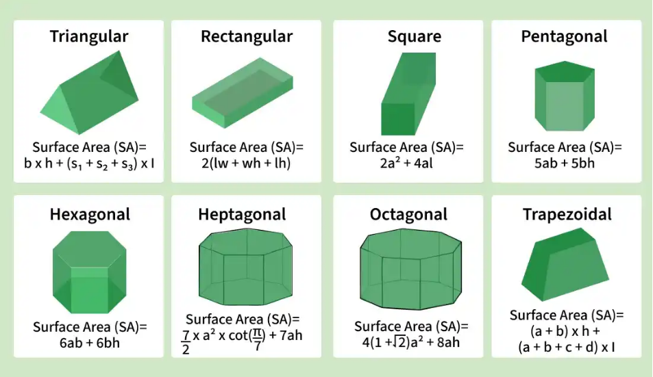
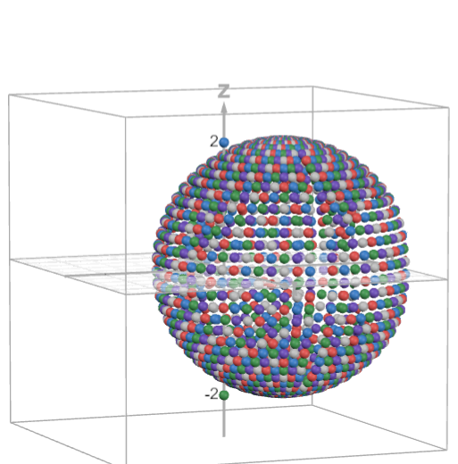

# HW 3

## instructions

In this assignment, you will extend the provided hw3.zip below to build your interactive 3D scene.

1. Test the provided code. Use the mouse to drag and rotate the object and the keyboard (arrow keys, w and s) to move the camera. (0 pts)

2. Define at least two additional geometric primitives **(e.g. prism, cylinder, cone, sphere, torus, etc.)** and add them into the scene. The more you can do here, the less work needed in the future assignments. (2 pts)

3. Create at least two UI components **(e.g. buttons, sliders, or menus, etc.)** to trigger events such as selecting objects, changing rotation directions, applying different motions, or inserting new objects, etc. (2 pts)

4. Apply motions to the objects. There have to be at least **three different types of transformations** from translation, rotation, scaling, shearing/skewing, mirroring/reflection, etc. (3 pts)

5. Outstanding effects and creativities will get 1 bonus points.


### building 3d shapes

**requirement: at least two that are not cube**




at minimmum, i have: sphere, cylinder

### add UI components

**requirement: add at least 2 ui components**

ideas: 

1. switch between shape types.
2. add more shapes, clear, click/select to remove? idk about last one, might be a nightmare.
3. orbiting objects?

let's do something that is helpful for me.

+ let's add a drop down that switches between the shapes.
+ what would be awesome is sliders that change some of the values.

### transformations

**requirement: at least 3 motions**

1. maybe display with UI interaction as well? two birds there.


#### sphere

these points are being generated with a MAth.floor drop, looking the most sane:
```
(0, 0, 1) 
(0.479425538604203, 0, 0.8775825618903728) 
(0.42073549240394825, 0.22984884706593015, 0.8775825618903728) 
(0.2590347239999257, 0.4034226801113349, 0.8775825618903728) 
(0.033913221008892595, 0.47822457120764106, 0.8775825618903728) 
(-0.19951142125004898, 0.4359404086073183, 0.8775825618903728) 
(-0.38408870938290723, 0.28692283002665153, 0.8775825618903728) 
(-0.47462768589678817, 0.06765653587193131, 0.8775825618903728) 
(-0.4489612516838977, -0.16817443786841677, 0.8775825618903728) 
(-0.3133734449877386, -0.3628304439300083, 0.8775825618903728) 
(-0.1010608896776051, -0.46865290316341907, 0.8775825618903728) 
(0.13599489604735257, -0.45973278686101987, 0.8775825618903728) 
(0.3397543882321063, -0.3382540505935699, 0.8775825618903728) 
(0.8414709848078965, 0, 0.5403023058681398) 
(0.7384602626041288, 0.4034226801113349, 0.5403023058681398) 
(0.4546487134128409, 0.7080734182735712, 0.5403023058681398) 
(0.059523302749876744, 0.8393630887186532, 0.5403023058681398) 
(-0.35017548837401463, 0.7651474012342926, 0.5403023058681398) 
(-0.6741391071468371, 0.5035969444792496, 0.5403023058681398) 
(-0.833049961066805, 0.11874839215823475, 0.5403023058681398) 
(-0.7880011308845267, -0.295173908058077, 0.5403023058681398) 
(-0.5500221413615028, -0.6368273410318358, 0.5403023058681398) 
(-0.17737854894038602, -0.8225632307910281, 0.5403023058681398) 
(0.23869349855450117, -0.806906953756989, 0.5403023058681398) 
(0.5963250528764563, -0.5936917125794016, 0.5403023058681398) 
(0.9974949866040544, 0, 0.0707372016677029) 
(0.8753842058167891, 0.47822457120764106, 0.0707372016677029) 
(0.5389488413540798, 0.8393630887186532, 0.0707372016677029) 
(0.0705600040299336, 0.9949962483002227, 0.0707372016677029) 
(-0.41510438314691145, 0.9070196245905846, 0.0707372016677029) 
(-0.7991367400579124, 0.5969729633658758, 0.0707372016677029) 
(-0.9875125521345757, 0.1407665005492413, 0.0707372016677029) 
(-0.9341108507444101, -0.3499045110051843, 0.0707372016677029) 
(-0.6520062348371742, -0.7549066949190968, 0.0707372016677029) 
(-0.21026775312939655, -0.9750813916254057, 0.0707372016677029) 
(0.28295160788871765, -0.95652215650941, 0.0707372016677029) 
(0.7068945470133586, -0.7037729376034583, 0.0707372016677029) 
(0.9092974268256817, 0, -0.4161468365471424) 
(0.7979835653540055, 0.4359404086073183, -0.4161468365471424) 
(0.49129549643388193, 0.7651474012342926, -0.4161468365471424) 
(0.06432115545729157, 0.9070196245905846, -0.4161468365471424) 
(-0.37840124765396416, 0.826821810431806, -0.4161468365471424) 
(-0.72847782813465, 0.5441891806605762, -0.4161468365471424) 
(-0.9001976297355174, 0.12832006020245673, -0.4161468365471424) 
(-0.8515176560872232, -0.31896628631177854, -0.4161468365471424) 
(-0.5943564625123038, -0.6881585615987542, -0.4161468365471424) 
(-0.1916760780080705, -0.8888656206374785, -0.4161468365471424) 
(0.2579332953294609, -0.8719473754718751, -0.4161468365471424) 
(0.6443916022321794, -0.641546002562911, -0.4161468365471424) 
(0.5984721441039564, 0, -0.8011436155469337) 
(0.5252087174427744, 0.28692283002665153, -0.8011436155469337) 
(0.3233558794572173, 0.5035969444792496, -0.8011436155469337) 
(0.04233424474998412, 0.5969729633658758, -0.8011436155469337) 
(-0.24905228953044703, 0.5441891806605762, -0.8011436155469337) 
(-0.47946213733156917, 0.3581689072683868, -0.8011436155469337) 
(-0.5924829320872974, 0.08445639379955634, -0.8011436155469337) 
(-0.5604432415034112, -0.20993399039111313, -0.8011436155469337) 
(-0.3911874992581194, -0.45292521203016023, -0.8011436155469337) 
(-0.1261554140534463, -0.5850245454452234, -0.8011436155469337) 
(0.16976391633539115, -0.5738894666909797, -0.8011436155469337) 
(0.4241191192817572, -0.42224623139591594, -0.8011436155469337) 
(0, 0, -1)
```

using a higher step, offcenter: 

