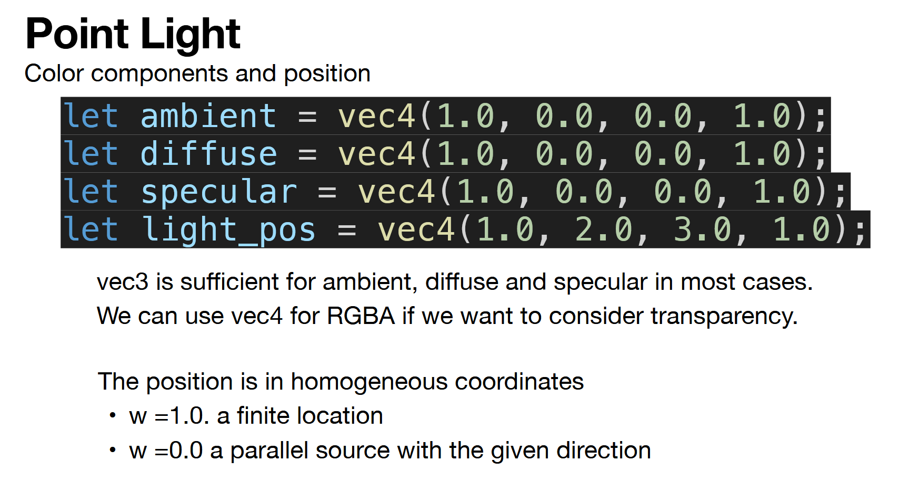
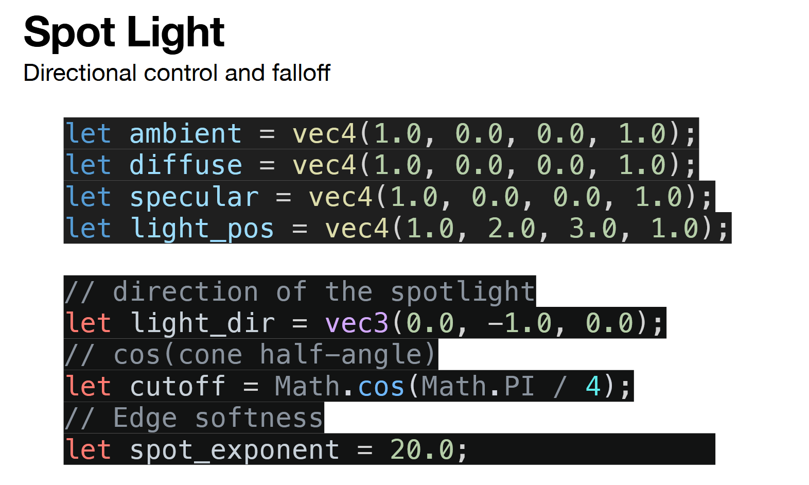
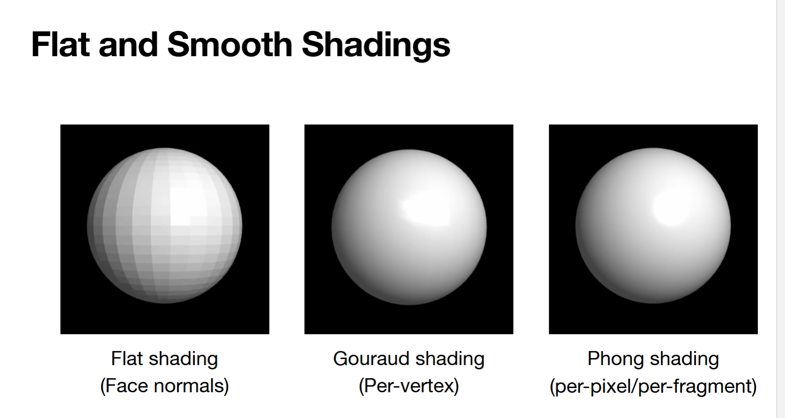

# HW 5

## instructions 

In this assignment, you will extend the provided template code and implement lighting and shading on top of it. 

1. Geometric Primitives with Shading (2 pts):
   + Your scene should include at least **four geometric primitives organized in hierarchical model with at least 4 levels including the root**.

2. Different Types of Reflections and Shading (4 pts):
   + Implement and demonstrate **different materials and reflection types**. **Both diffuse and specular reflection** must each appear on at least one geometry, either separately or combined. (2/4 pts)
   + Implement and demonstrate both **flat shading and smooth shading**, either on different geometries or on two copies of the same geometry. (2/4 pts)

3. Multiple Lightings (2 pts):
   + At least two light sources in the scene (including the provide light source).

4. Interactive Controls (4 pts)
   + Add UI controls for the movements of at least two segments/objects, beyond the controls already provided in the template. (2/4 pt)
   + Add UI controls for adjusting lighting or materials on at least two segments/objects. (2/4 pt)

5. Outstanding effects and creativities will get 1 extra points. (+1 pt)

6. If you plan to submission by uploading files, you need to zip the folder (put your name as part of the folder name) containing all required code, and upload the zipped file. If you plan to submit URL of a GitHub webpage, make sure you don't edit your online repo after the deadline because the timpstamp of the last edit will be considered as the submission time.

