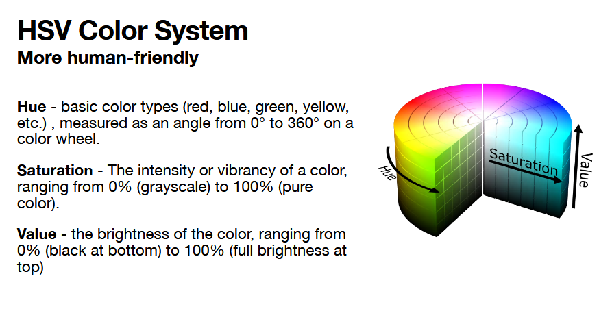
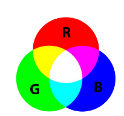
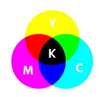

# 8.20.26

try to not ask questions after class, go for office hours and email when possible.

**random checking for graphics hw**
	
will pick like 5+ for a random check for understanding; if probably AI, DEF gonna get checked
explain code with comments removed

no insane how to change questions

just understand the mathematic mechanisms, pipeline, and code, all good

hw extension is a special accommodation, not normal

## Light

most essential part of graphics -- it's what we see! - model light behavior

what we render

cheat your brain to fake the realism -- core is in light
remember your colors are light, the basic physics of that

 + **core goal: object that REFLECTS vs object that EMITS**

**RGB -> (255, 255, 255) - (0, 0, 0)**

review: range of visible light wavelengths: 380 - 750 nm

visible spectrum is wildly narrow

**electromagnetic radiation**
+ can you do scientific simulations by doing graphics of light waves but altering whatever the frequency is

color we see is the wavelength reflected, all others are absorbed

**perception**
	
two systems: rods, cones
+ rods: detect brightness, not color -> the reason we can see at night
+ cones: picks up colors; very sensitive to red, blue, and green--specific wavelength spectrums
	+ huge reason we use RGB
		
computers don't simulate the entire discrete visible spectrum, choose 3 and approximate with them!
+ each of whole picture is a solid color of an RGB value (0, 255)

*supplementary notes:*
+ each pixel has 3 lights: a red, blue, green
+ brightness controls how MUCH red, blue green
+ so like a 50, 0, 0 is a dark red, approaching black and 50, 50, 50 is a dark gray

*why does brightness change the color we see?*
+ brightness is W/m^2 (watts per square meter)
+ change the brightness with how much voltage is given to a light

### HSV

imagine a cylinder

**Hue**
	basic color types (red, blue,...) measured as an angle from 0 deg - 360 deg on a color wheel

**Saturation**
	intensity/vibrancy of color 0% - 100% (pure color)
	0% -> greyscale, 100% purecolor

**Value**
	brightness of color 0% (black) 100% full brightness

### luminance and color images

WE ARE sensitive to BRIGHTNESS change
+ luminance captures brightness
+ **brightness and color are context-dependent**

(1/6 people are perceiving yellow/brown more sensitively?)

most graphics doesn't fully follow physics due to hardware limitations--trick within limitation

with light, maybe 3 - 7 light bounces (3 for a laptop, 7 for a nice gpu on desktop)

### additive color

**you are adding light to control what color is EMITTED.**

mix together RGB lights
+ mixed equally -> white

**for devices that emit light**
+ mix red green and blue from led lights that emit those colors
+ *question: are the lights limited to just red, blue, green; or do they have a blend? there is the blend coming from? just need a little extra help there*
  + **yes -- see above, but all pixels have sub pixels -- one r, g, b; brightness of the sub pixels achieve different shades.**

### subtractive color

**you are subtracting light to control what color is ABSORBED.**

mixing reflected light:
+ cyan, yellow, magenta, and black pigment
+ mixed equally -> black
+ going for what you want absorbed
	
have to find the right pigment that will REFLECT what the designer wants

!!!!!!!!!!!!!!!!!!!!!!!!!!!!!!!!!!!!!!!!!!!!

***question about this on midterm***
-> understand the differences between them

!!!!!!!!!!!!!!!!!!!!!!!!!!!!!!!!!!!!!!!!!!!!!!

### Gamma correction

$$
\begin{aligned}
V == voltage \\

Brightness = V^\gamma

**V_corrected = V_desired^1/gamma**
**-> pixel values from [0, 1]**
\end{aligned}
$$

**$\gamma$ = 2.2 for more most monitors**

WHY?
	our perception is NOT linear, but the LED intensity is
		gamma correction changes out eye perception to be linear and the led drive to be curved instead
	double intensity does not mean 
	more voltage to screen -> more brightness 
	*PWM?*
	makes it so you are seeing what the programmers want you to see :)

### pinhole camera

TODO: pic

**x_p = -x/z * d**
**y_p = -y/z * d**
**z_p = d**

pinhole is origin
x, y, z -> point in 3d grid as start of line 

point x_p, y_p, z_p is against the inside box

d is the length of the box

the visual is upside down
each visual seen is coming as a source of light through a source point

### synthetic camera

got 3 components
	camera (virtual eye)
	viewport
	viewing direction

v' = M * V * P * v

Model matrix
View matrix
Projection matrix