# 8.25.26

no homework on paper, homework is PROJECTS

group project for final project
+ unless people drop, 5 people per group
+ likely a presentation 
+ he's not interested in one person doing 90%, bring it up if happens

## synth camera (continued)

+ if you change the viewing direction, you'll see different things and others disappear
+ to get the correct image showing, need to consider the direction and location of objects
+ this is core of pipeline!
+ **he has given access to a basic 2d pipeline.**

## pixel coordinates

(0, 0), (3, 0)
(0, 3), (3, 3)

pixel coords used as a standin for what would really be a continuous spectrum (we don't use floating point real numbers)

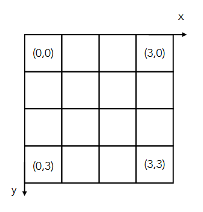

+ if you want to move things, you need to just be sure what direction the x,y,z are going in (ie above, to move up, need to *decrease* y)

## images

grey scale: values [0, 255]
f(x, y) = c

color: R:[0, 255], G:[0, 255], B:[0, 255]
f(x, y) = (r, g, b)

+ 8 bits used (2^8 == 256...)
+ can rep 256 * 256 * 256 colors with rgb

(this is not part of any exam:)
+ Low dynamic range (LDR)
  + 8 bits integer per channel
  + 16 bits integer per channel
  + values are clamped at a hard [0, 255]
+ High dynamic range (HDR)
  + 16 bit half floar per channel
  + 32 bit float per channel
  + more precision on color
  + not using integers; not clamped, bounded by format precision, but no hard max/min
+ the interval between the ints is the same, but floating point intervals are DIFFERENT
  + remember all that talk about floating point numbers clustering together near 0 in floats, etc...
  + they have the ability to take that and make a...more precise/realistic digital image.
  + HDR uses the same amt of storage but cover a wider range

## tone mapping (wont be on exam)

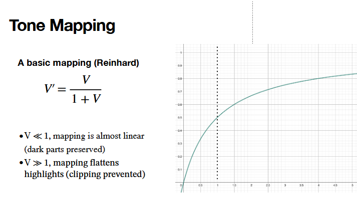

supposed to be paired with HDR

## multi exposures

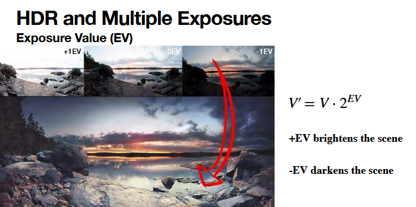

changing the level of brightness in the image

more voltage -> brighter

the idea of the picture is that you can take multiple exposures and get a fuller picture with higher color quality.

## image data storage

+ **interleaved**: 3 lights per pixel (subpixels)
+ **planar**: 1 pixel plane of reds, 1 of greens, 1 of blues.

if you see weird artifacts, its very poss you're using mixing the data storage types
+ can use PIL or such libraries to convert.

## image formats

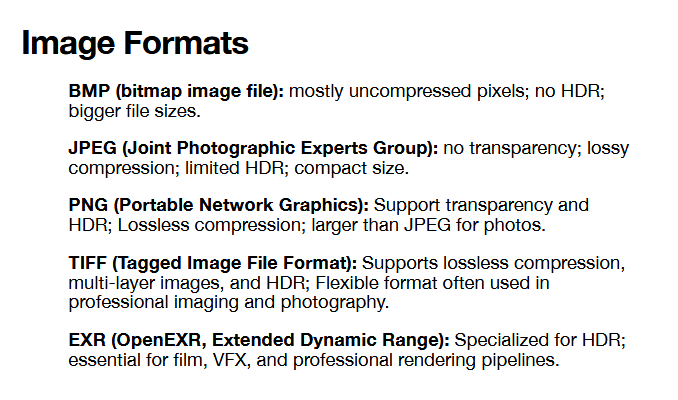

+ EXR is great for speed and professional work

## alpha channel

$\alpha$ -> opacity

$\alpha = 0$ -> transparent 
$\alpha = 1$ -> opaque

RGB -> RGBA

+ don't need to use if actually not using
  + don't waste that 25% storage cost!
+ also 8 bit [0, 255]

### alpha blending

consider the interplay of transparency and overlapping! 

this shows what contributes what according to the alpha channel

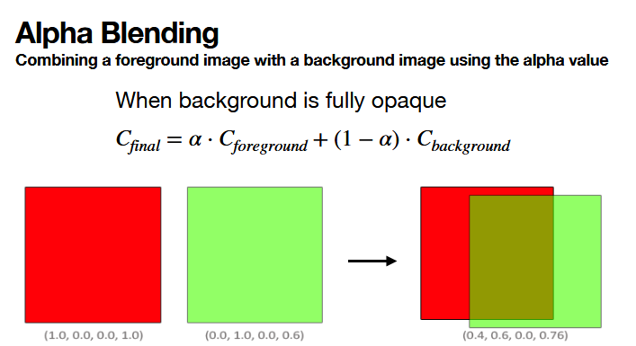
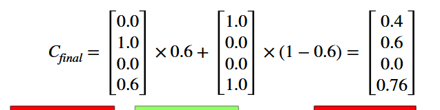

final opacity depending on differing alphas per diff objects:

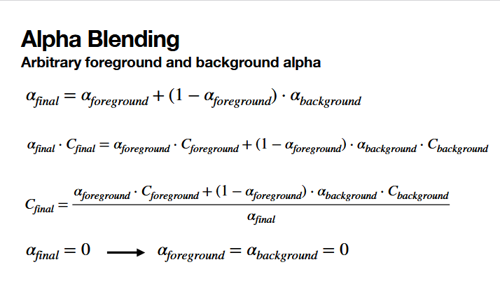

two diff ways to blend

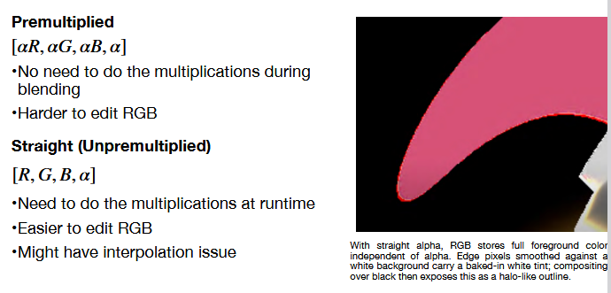

(not covered in midterm)
+ premulti: keep track of the calculations along the way
+ unpre: interpolation issue
  + meaning: the prior background gets a bit baked in and then switching background colors there's a bit of shitty fuzziness that carries through and it is an interp issue

## blending modes

1. additive blending
2. difference blending
3. multiply blending

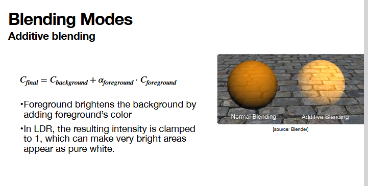

+ why does adding values make it brighter? ADDITIVE COLOR!
  + refresh: more color in additive color means white!
+ we are adding pixel values!
+ 
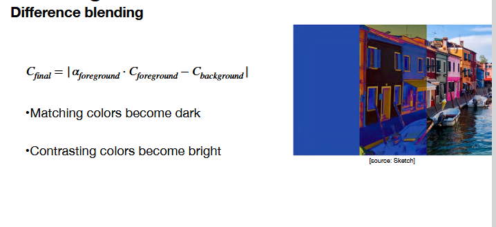
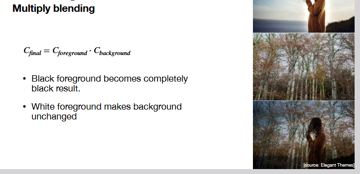

TODO: play with blending modes

## webgl and graphic pipeline

why do we like gpu??
+ HIGHLY paralellized
+ also: great at matrix calculations and floating point arithmetic
+ cpu is just too serial for us
+ pixels need to be updated in parallel when new frames display -- why we NEED gpu for things like that

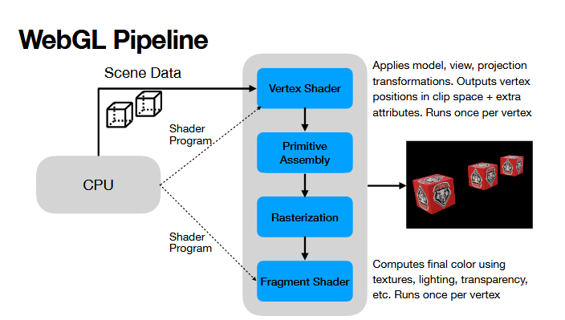

+ cpu gets the scene, packs it, and sends it gpu for processing.
+ transformation: texture, lights, color changes, etc...
  + vertex shader
+ primitive assembly: create points of triangle that make your plane
+ rasterization: convert triangles to pixels to fill
+ color: determine color on screen
  + fragment shader

note: opengl has one more shader, but webgl only has vertex and frag
-> more lightweight 

triangles are the building blocks of graphics
WHY?
+ because we want to define a plane
  + if we have a plane we can get normals, calculate reflections, etc etc. if we don't have a surface with all 3 points on same plane, we can define all sorts of math stuff we'll need

how to move the triangle? MOVE THE VERTICES