# 9.1.26

## animate the change of the shape

```
if gl_VertexID == 0 // this is how to access the different vertices
```

## 2d transforms

### linear transformation

matrix, matrix, matrix

affine vs linear transformation
+ QUESTION ON THE MIDTERM
+ translation of object is affine translation!
  + something about change in relation to origin of grid?

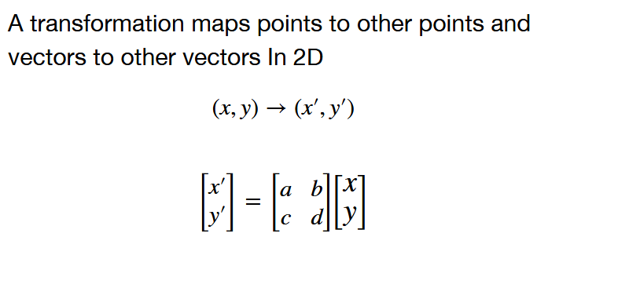

#### scaling

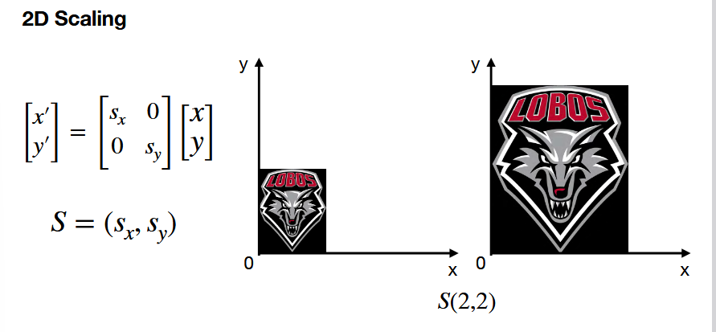

example above: makes it 4 times bigger

#### rotation

this rotation is about the origin, you need to adjust to a different point (see notes on this in playground) to get it to rotate around something else

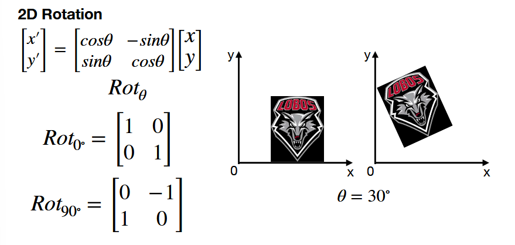

#### skewing/shearing

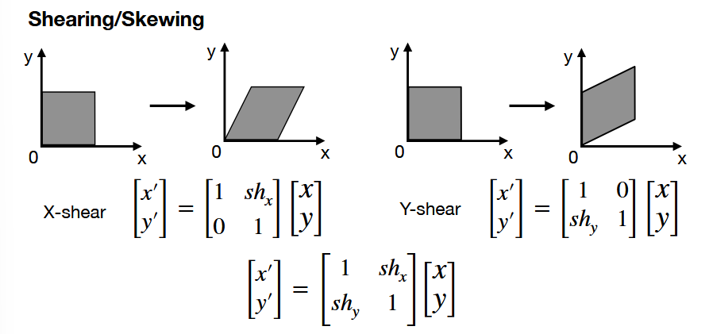
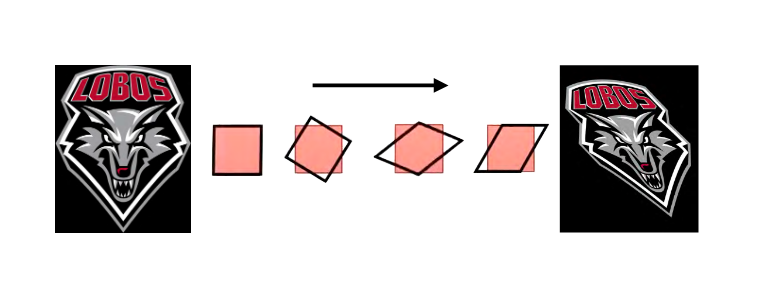

#### mirror/reflect

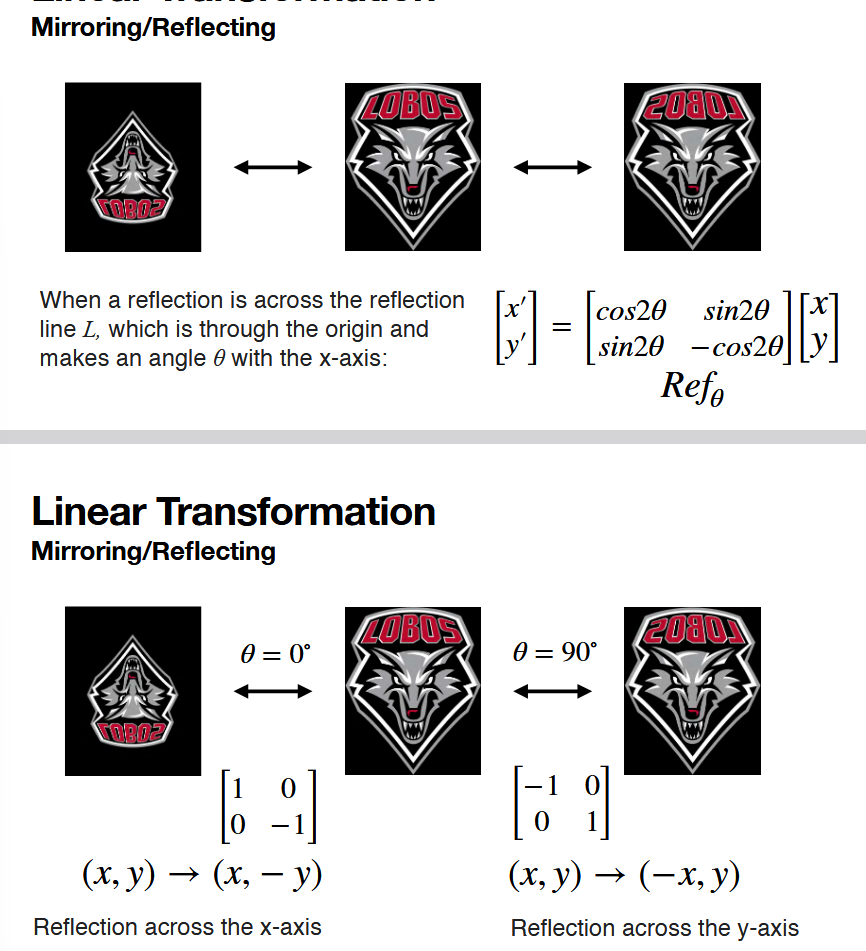
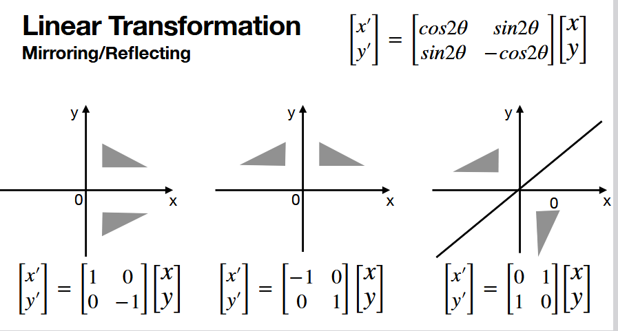

### affine transformation

**linear mapping + translation**

+ all linear are affine
+ not all affine are linear (translation is the odd man out)

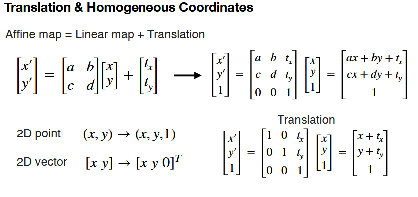

^^^ see above, we represent a 2d space change by a 3x3 -- this is why
+ we can can represent ALL transformations (affine (linear and transformation)) with a 3x3, but not a 2x2. 
  + this extends to n-D
+ we want it all in a single matrix because of paralellism/gpu efficiency

TODO: what makes translation non-linear is because you are changing the origin of geometry itself (not the coordinate grid)

### homogenous coordinates

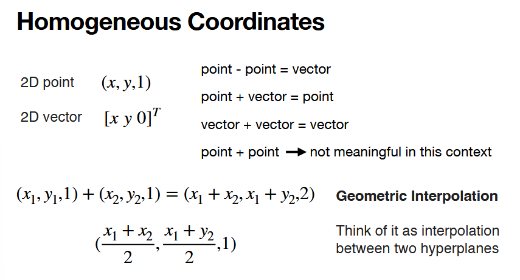

MIDTERM! 2d point v 2d vector in homogenous
-> point, right term 1
-> vector, right term 0

p - p -> directional vector between points

p + v -> move point in direction of vector

v + v -> change the magnitude/direction of the vector

p + p -> ignore BUT
+ geometrically the interpolation between 2 hyperplanes:
  + 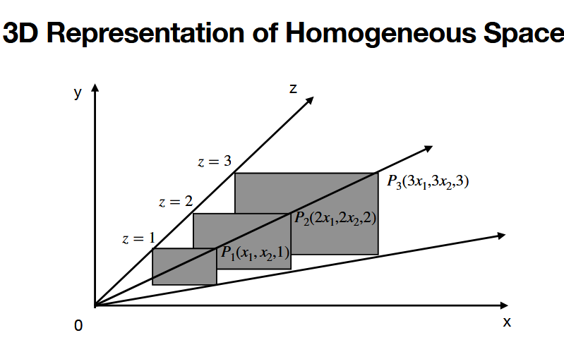
    + getting 3d points back onto 2d plane
    + this is critical for **perspective transformation**
    + thing the box with x in it to trick your eye to thing things are far away

**affine transformation for 2D operations with homogenous coords:**

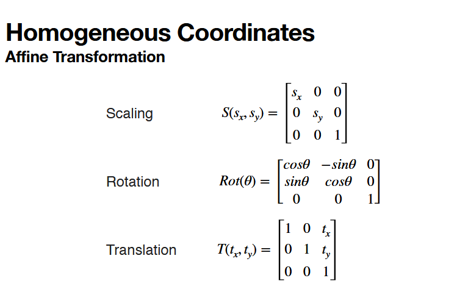

```
[
  linear, linear, trans,
  linear, linear, trans,
  helper, helper, helper
]
```

MIDTERM be able to see if something is a rotation, scale...... and if things are linear or transform or affine (all affine, easy peasy)

### more than one transformation

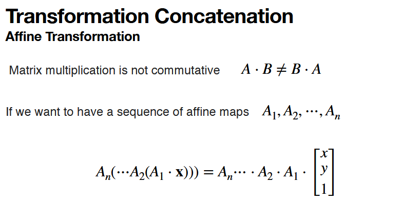


**ORDER IS IMPORTANT**

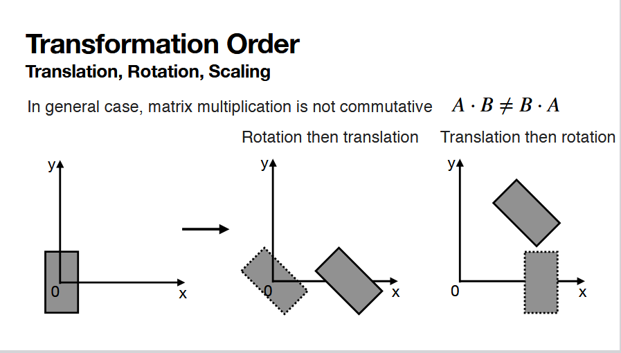

+ evidence above: translation DOES NOT PRESEVE THE ORIGIN
  + note tha second rotation is around the original origin! the origin of the shape has changed!

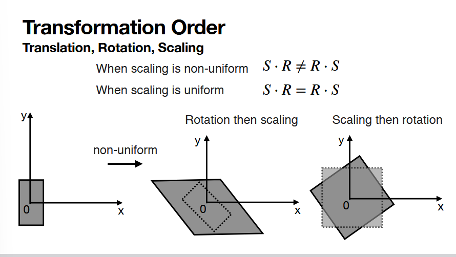

+ AB != BA!!!!!

## typical pipeline of trans ordering

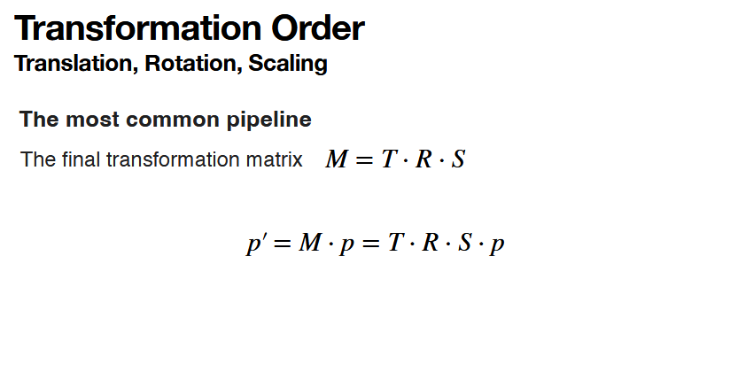

rotate about an arbitrary pt

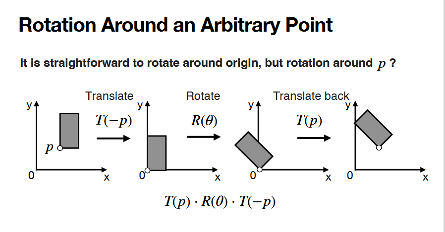

+ many times a rotation should be done after translating back to origin
  + think the robot example in class
    + if you want to move a hand, you likely want to move back to an origin, rotate, then translate back to not have unexpected things

## rasterization

rasterization is really just figuring out the pixels to fill in based on the vertices


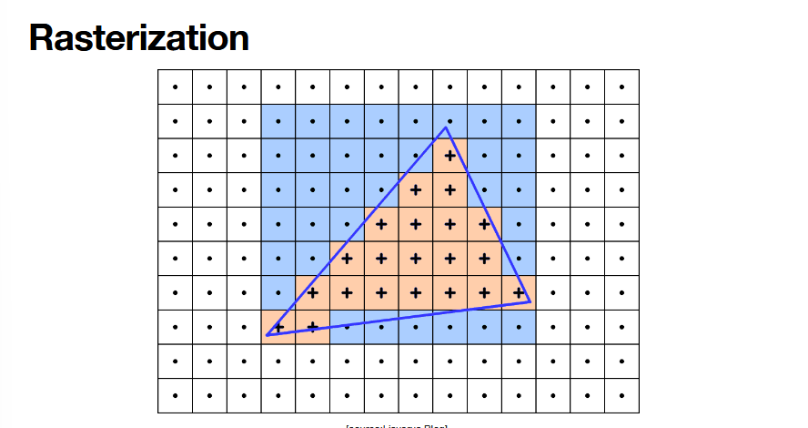