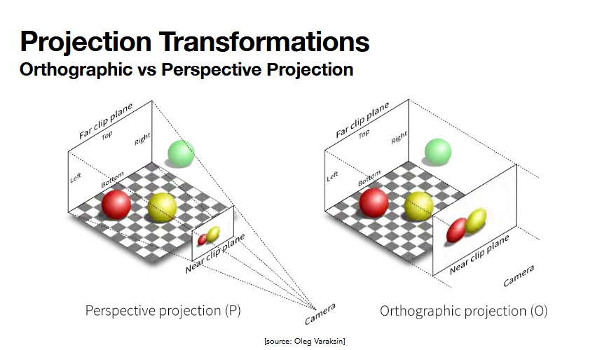
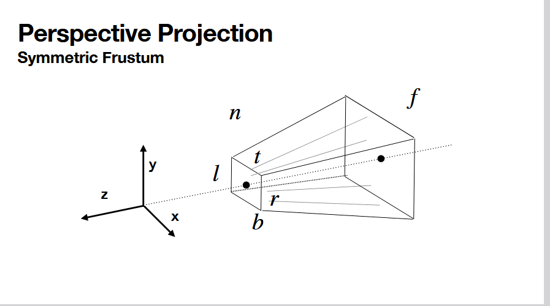
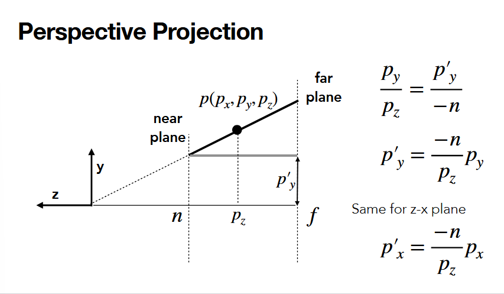
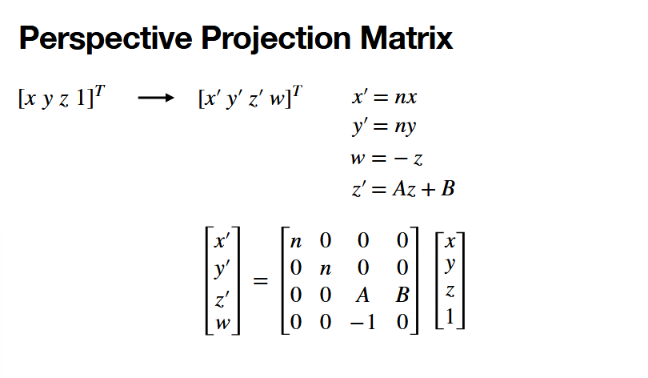
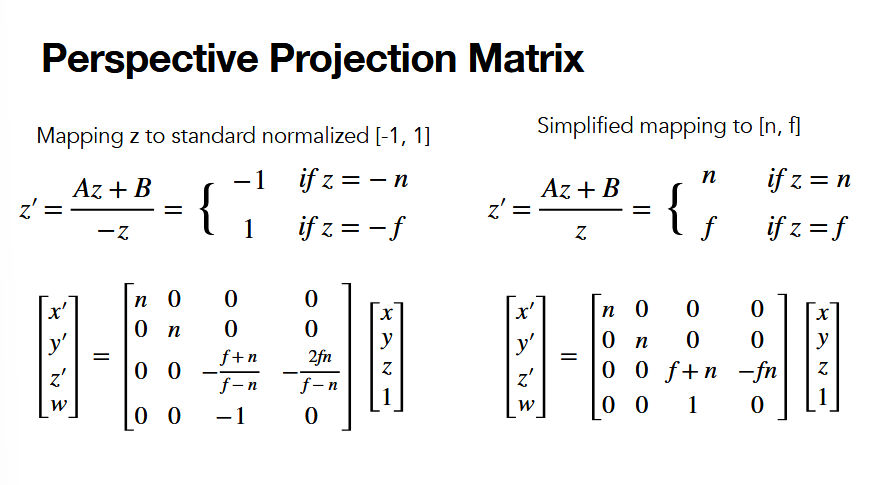
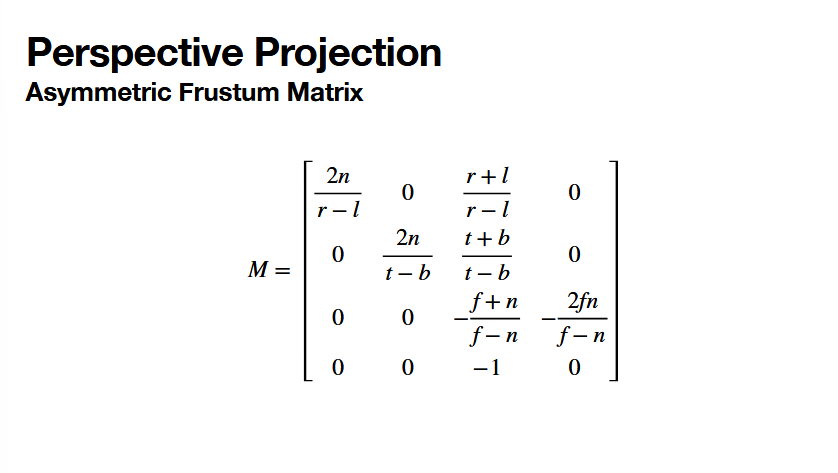
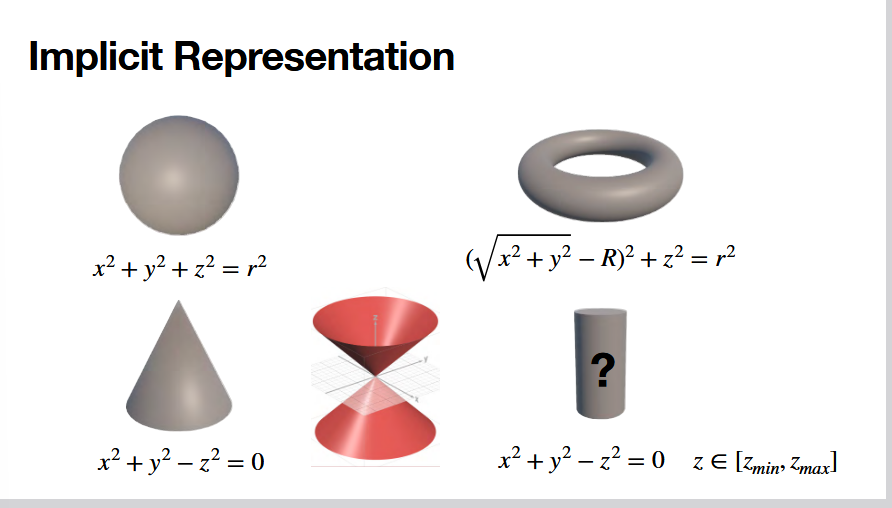
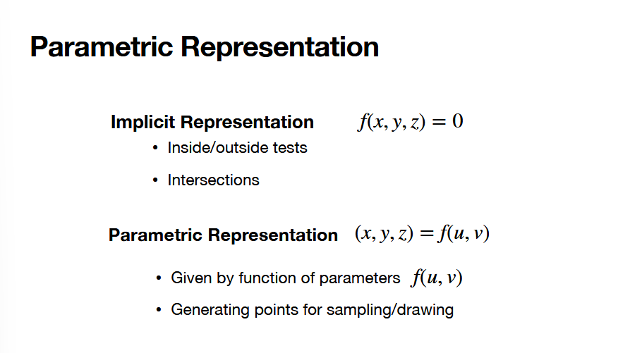
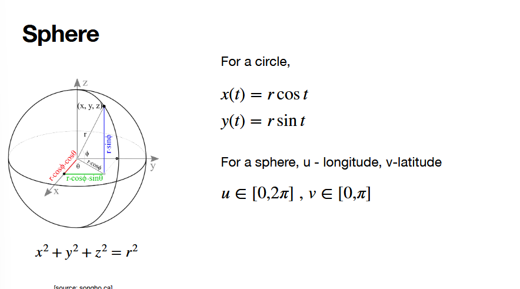
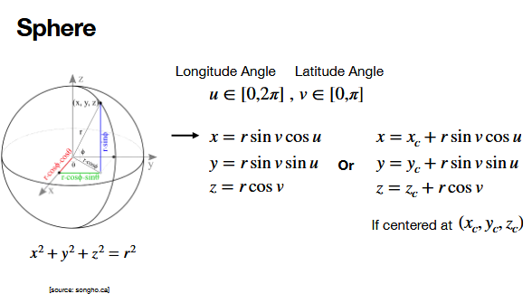

# 9.10.26

## quiz review

1. color model use by computer monitors to create colors -- additive, because they EMIT light (not reflect, light reflection uses subtractive)
2. which ones affine -- ALL, because affine is all linear and tranlation (y = Ax + b)
3. shear transformation [1, sh | 0, 1] * (x, y)-> (x + shy, y)
4. common approach to rotation, translation, scaling: TRS
   + this is just for human to understand what is going on and to achieve an expected result. math doesn't give a shit.
5. just color in between
6. multiplacation is not commute
7. translate back to origin
8. homogenous -- combie translation with linear transforms; enable perspective transformation; represent positions and directions consistently in the same framework; efficiency -- matrix mult
9. pixels are smallest discrete unit of digital image; rasterization is process of mapping continuous geometric data into discrete pixels on screen.
10. explicit struggles with vertical lines, circles -- TODO

## perspective projection

different perspectives

+ different ways to see a perspective projection

+ frustrum is just a truncated pyramid
+ squash the visible region back to a cube?

math -- pinhole camera!

+ camera is sitting at (0, 0, 0)
+ between near and far plane, we can see anything represented
+ all the trig and relationships stay the same in zy, zx planes

+ for any points, we see this ^^ relationship

TODO -- this lost me a bit, looking into this further ^^

+ this has everything to do with depth perseption i believe

youre scaling and positioning things in such a way that its aligned will with the z axis

our eye is looking towards the -z direction

asymmetric frustrum has to do wtih an asymmetric alignment with the z axis?

**JUST KNOW THIS WILL NOT BE ON MIDTERM^^, but good to look more into**

"correct the camera center when things don't align with z axis"

## MORE THAN TRIANGLES????

+ easy to define cubes, pyramids with specific vertices
+ more complicated -- progressively smaller and smaller triangles

for the more complicated want to use math to sample points on the shape.

implicit reps

+ why do we like implicit?
  + easier to see how things are inside, outside, on the shape
    + f(x, y) = 0, < 0, > 0

parametric -- generating points for sampling/drawing

given by function of parameters f(u, v)
+ u, v are independent vars
  + usually range -1, 1 -> specific ass range
  + traverse everything with distinct steps in this interval to generate points for this shape.

EX

(0, 2pi) with step (0, 0.1)

the point is to traverse this interval with certain steps to generate points.

### sphere, parametric

+ u traversing along the belt around the circle
+ v traversing top/down
  + v only going to pi -> because we don't need to the two halves of the sphere, huh

