# 9.15.26

3d baby, lfg

there'll be a bonus point for good shit on hw3

another practice quiz in ~2 weeks

midterm will be 2 - 3 weeks after that second quiz

## geometric primitives

refresh

with cubes/pyramids, pretty easy to define with points

not so much with curves
+ instead we sample points with **parametric representation**

parametric -- easier for us to traverse all possible paramters/all possible values in a range
+ using the 2 new parameters, u, v, to define the system/coordinate system

implicit -- its much harder to find and know all the "zeros" of this rep

*sphere -- why pi? not 2pi?*
+ i think may have something to do with how we are looking down at xy, which has 0 - 2pi, and z we only care about what is coming toward us, therefore 0 - pi

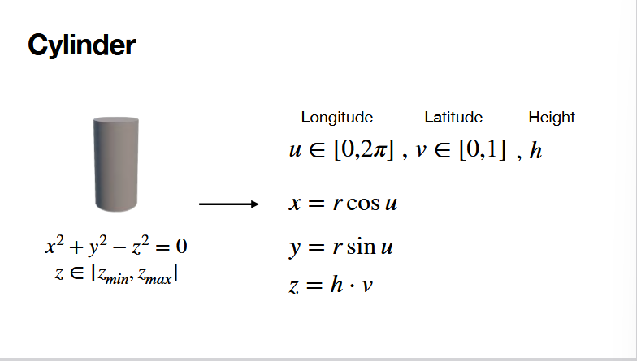

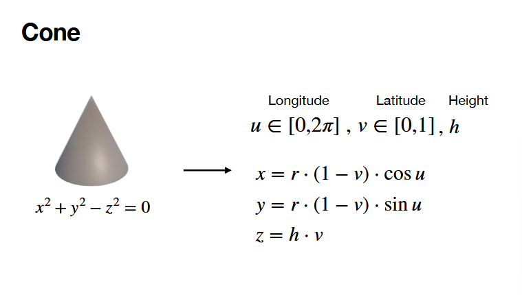
+ building from bottom to top

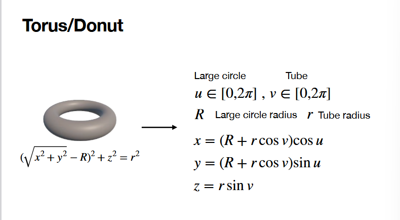
+ R -> center of donut to center of TUBE!! not outside of donut
+ r -> the radius of the TUBE
+ like sending sphere in a circle and sampling the points in slices

## generate sphere in webgl

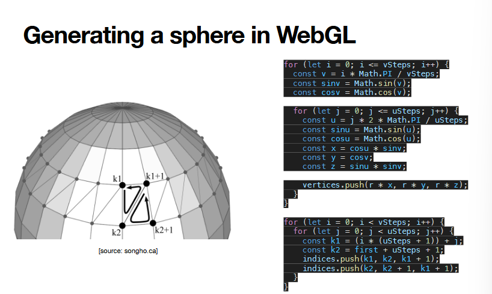
+ you quite literally for loop and generate points with the parametric form (vertices)
  + ustep,vstep -> larger, better resolution
    + too large, too slow to render, so be carful
+ and then indeces need to be set in that triangular pattern--defines the triangle vertices that actually need to be connected (otherwise, what connections do we even use)
+ vstep,ustep -- see the lines around the spehere
+ optimization -- that inner edge from k1 + 1 and k2 is saved twice. good thing to trash if possible.
  + out of scope of this class

## webgl

initialization code

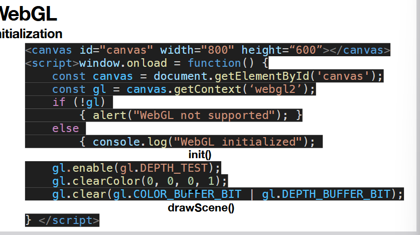
+ if you dont clear the buffer during animation, you'll get a new circle in each transition--clearing makes it look instead like a single circle moving.

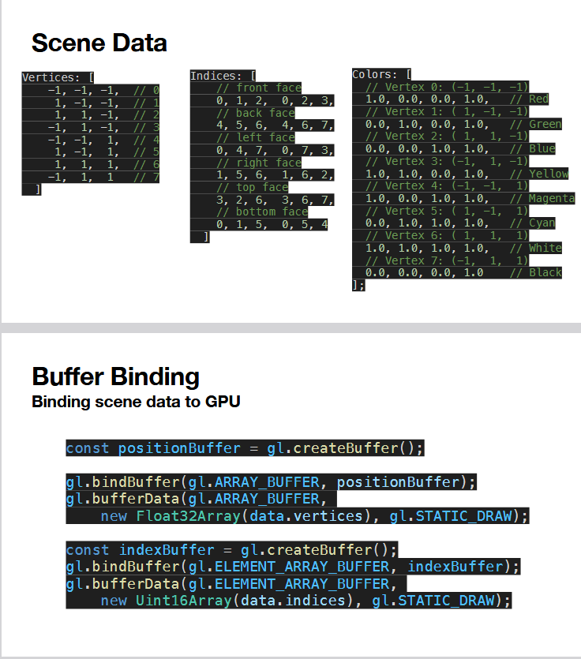
+ diff colors for vertices give you a gradient -- benefit of this
+ let the gpu help you interpolate the color
  + uses *barycentric interpolation* automatically between the colors during rasteration process.
+ creating buffer is assigning empty memory on gpu
+ ELEMENT_ARRAY_BUFFER -> likely for integer types that are not floats
  + indeces that point to vertices in array_buffer?
  + https://stackoverflow.com/questions/15094433/opengl-why-is-gl-element-array-buffer-for-indices

**vertex, frag shader**

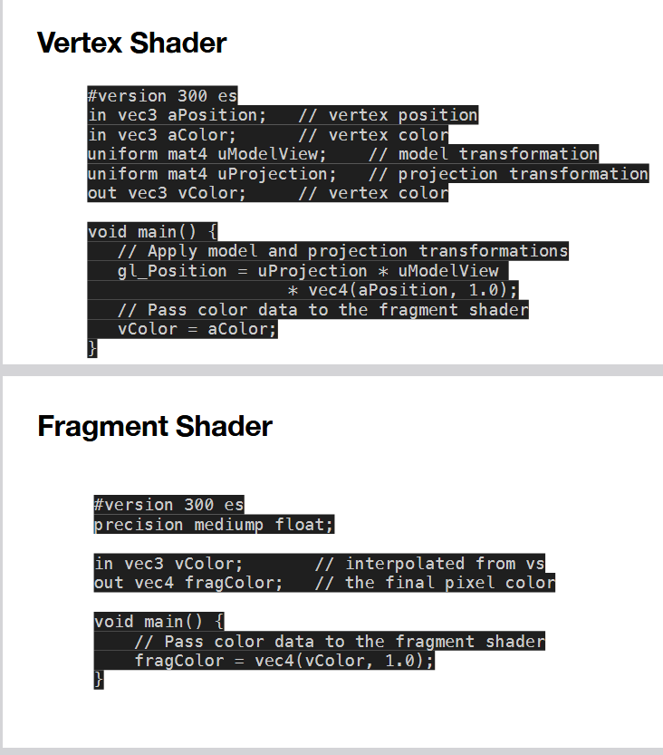
+ we will be implementing the proj and modelview stuff
+ in -> coming from a buffer

**compiling**

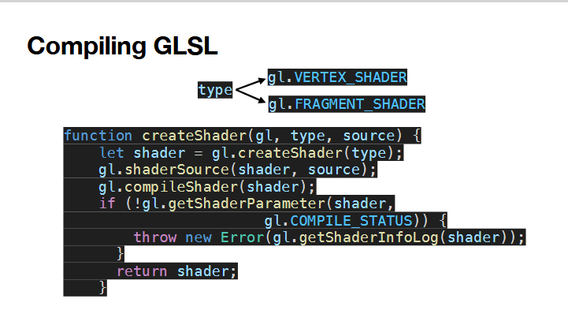

**linking**

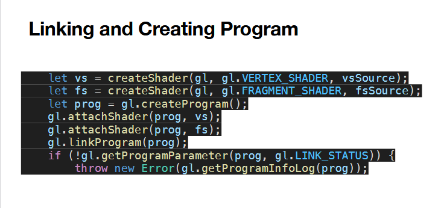

**uniforms**

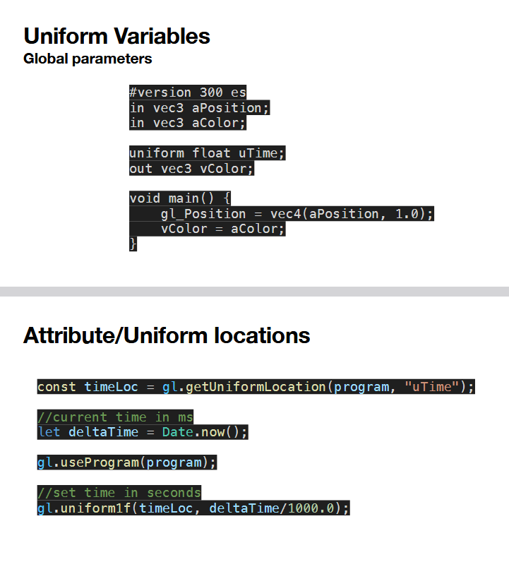
+ value that is constant for ALL vertices
+ Date.now() is absolute, not time elapsed

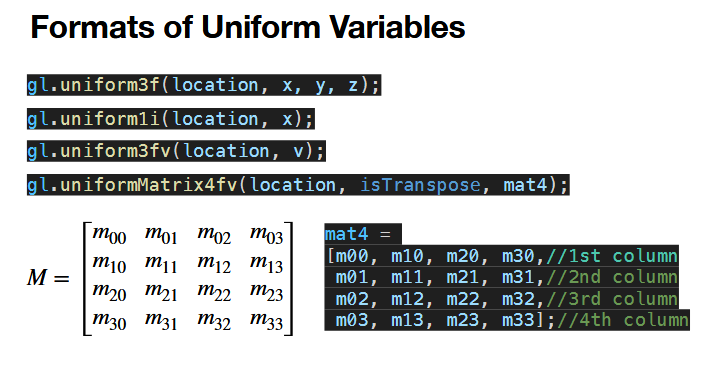

**rendering primitives**

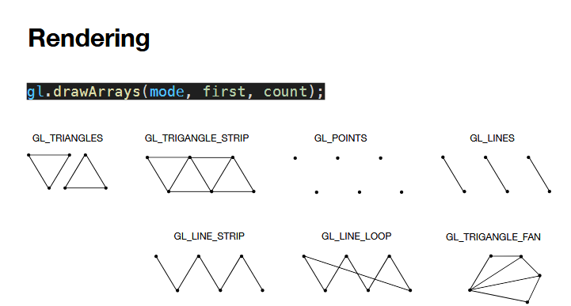
+ tells gpu how to interp the vertices in the buffer