# 9.17.26

**midterm on OCTOBER 13**
+ okay to bring calculators but not necessary (know what sin(30) is haha)

## renderings

`draw elements` -> use indeces to draw the triangles, not the raw point values.
+ define vertices in order.
+ reads a separate buffer of vertices
+ we care about indeces because we need to know WHICH triangles to draw.

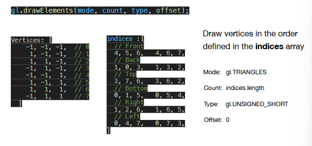

+ usually we use gl.TRIANGLES, but more complicated things can be drawn in diff modes (fan....)

**ui controls**:

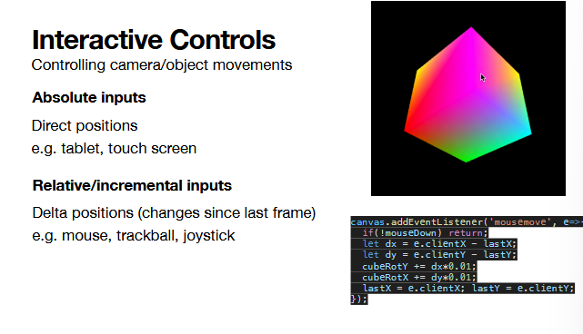

+ the hw 3 dragging feels like you're moving the object, but moving the camera? 
  + all movement is relative
  + **want to FIX the camera**
    + want to make everything ELSE move
  + camera is looking to -z direction--typically means a reveral of some kind is needed for effects
+ **direct positions** -- absolute position on the screen (used by tablets, if you touch the same spot over and over, the same position prints, so to speak)
  + if using a tablet, may want to consider this when designing
+ **relative/incremental** -- concerned with the CHANGE in position from the last time step. we don't care about the absolute position, but how much we've moved. -> using this in the initial hw
  + mouse movements work this way, move the mouse back to move something further

+ in the rtation of the cube, you can also view the rotation as rotating the camera around a fixed ovject, not a fixed camera and rotating shape
  + if you want the illusion of moving your camera moving around an object, you can simulate it by moving the object. it'll look the same!
    + simulate a reverse motion of the object, tricky!

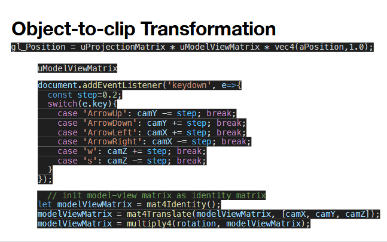

+ model view matrix brings the object to point to you in your world 
+ projection matrix brings 2d -> 3d
  + perspective or orthographic
    + if just a 2d game, you can just use orthographics
      + usually if building in unity, you're really building a 3d but using orthographics to have illusion of 2d
+ **clip space** -> the screen itself, these matrices bring it to clip space
+ whole pipeline: render something from its own space to your screen

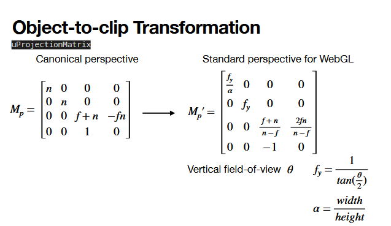

+ above is provided in hw, play with this! 
  + and also look this up more because oof he lost me the other day
+ field of view sets camera wider/narrower
  + fisheye shtuff

neat! recursive definition of points

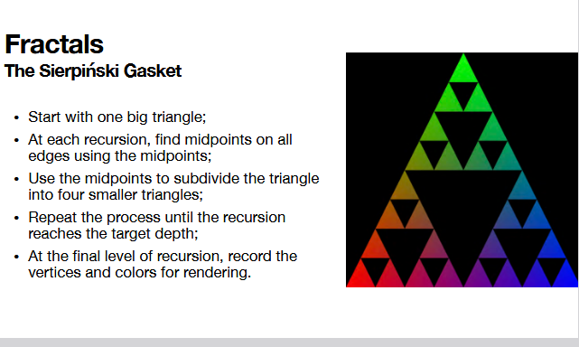

## hierarchical modeling

build complexity with a ton of little primitives! still a valid building technique.

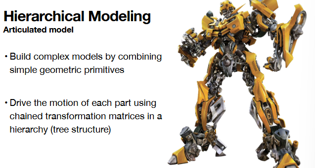
+ attach some hierarchies to make larger pieces
+ an arm is joints, muscles, etc...
+ we need hierarchy also because things need to be grouped together relatively to make sure the motion of a larger piece is cohesive
  + small piece needs to be relative to the larger piece

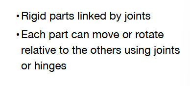

each part moves relative to the others!
+ the base is parent of lower part, lower part is parent of upper part, upper part is parent of top hand

when you move your finger, the finger is moving in its own coordinate system.

but if your shoulder moves, the finger doesn't move in its own coord system, but is moving wrt the shoulder coordinate system.

so, we need to propagate the movement of the shoulder to the fingers correctly (down the hierarchy) wrt the shoulder (parent)

note that the movement of the finger (child) has no effect on the shoulder (parent)

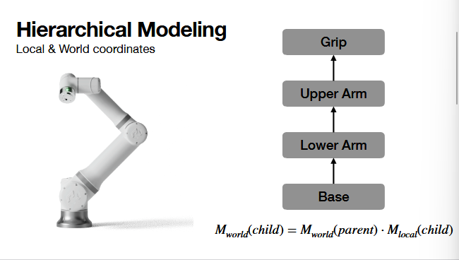

math-wise:

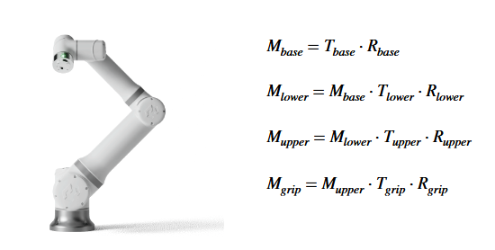

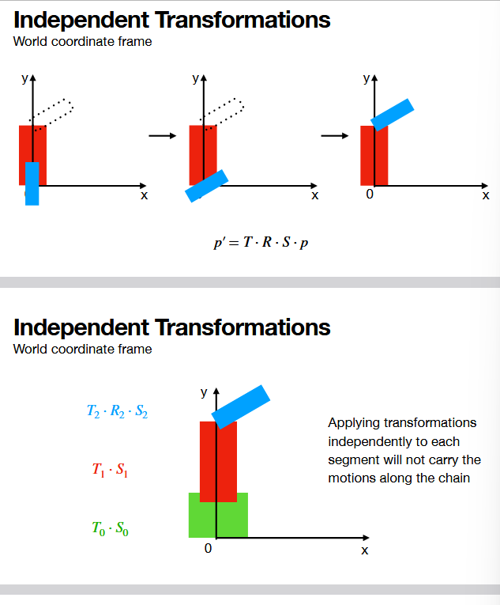

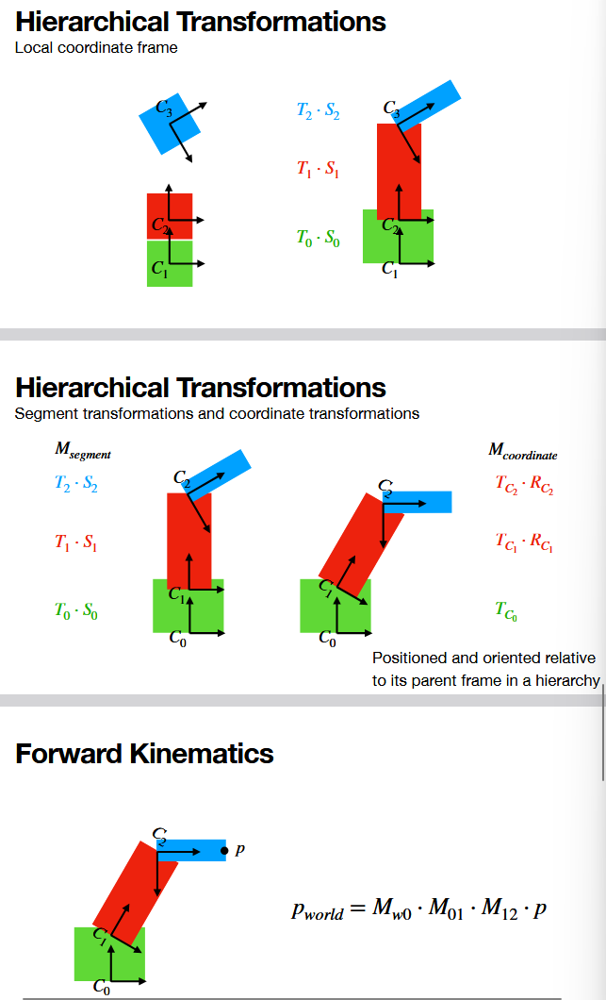