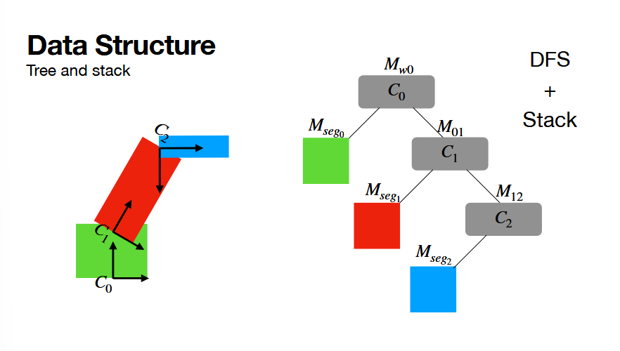
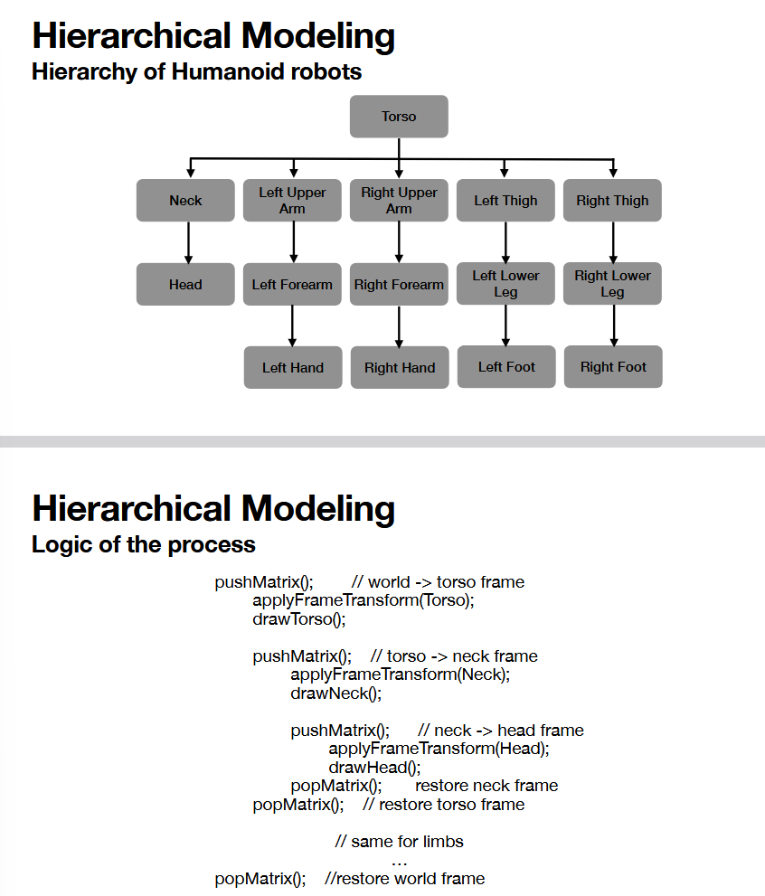
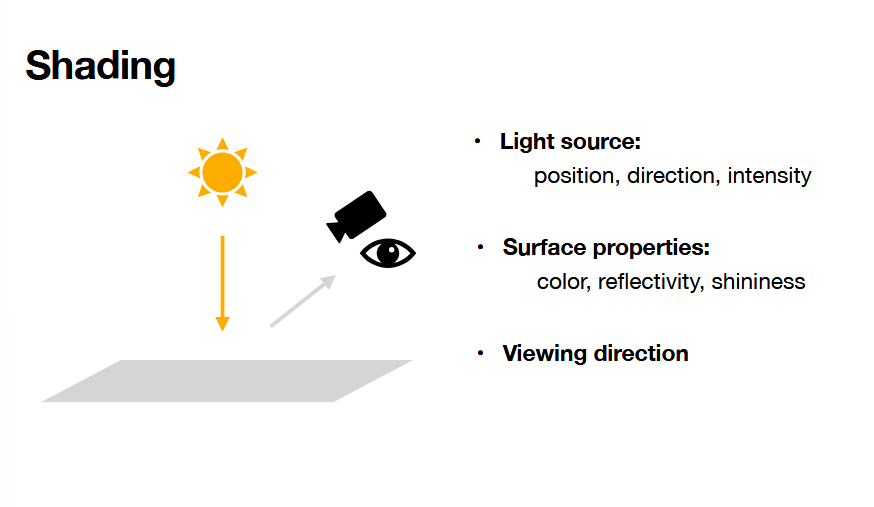
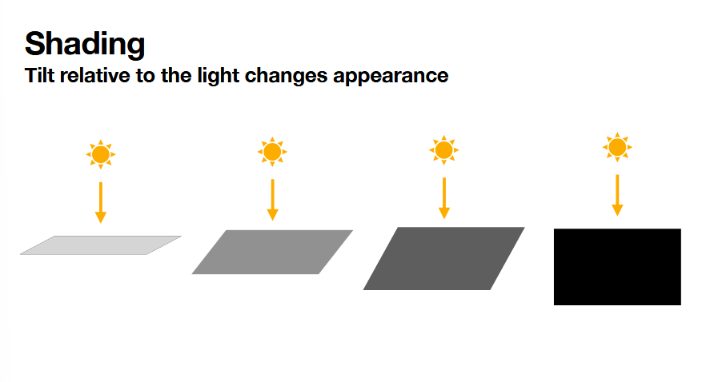
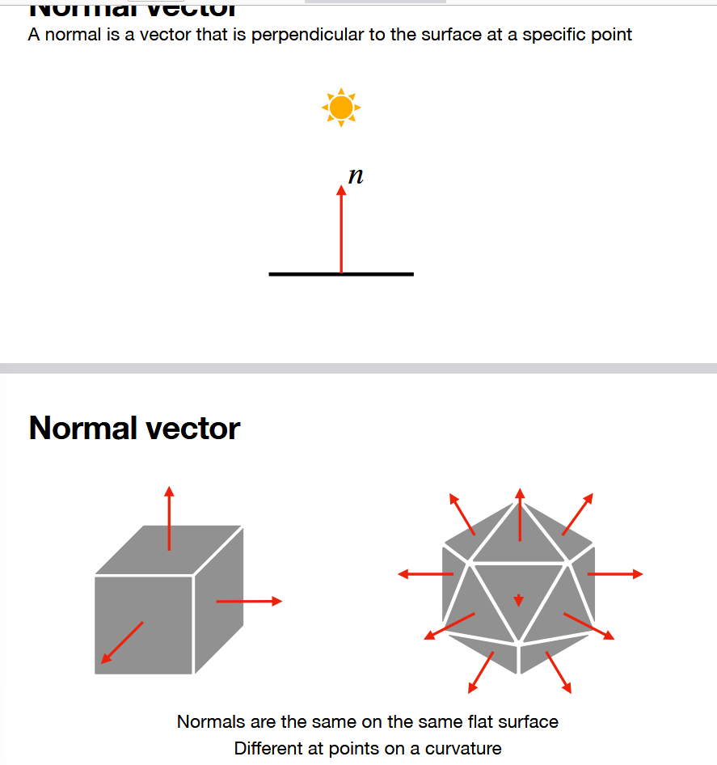
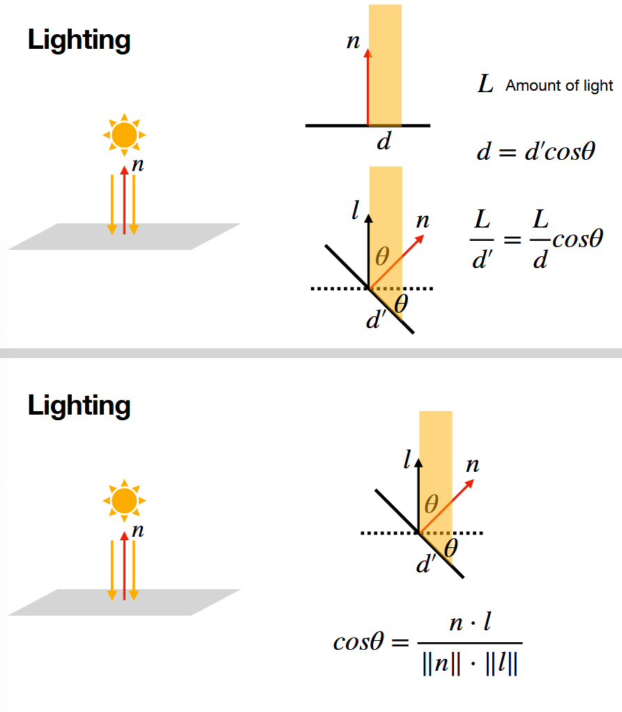
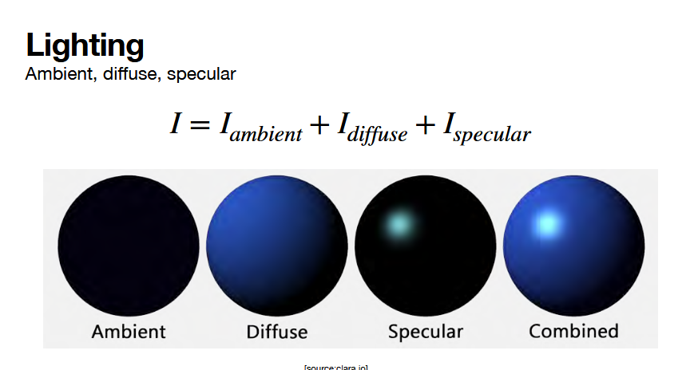

# 9.22.26

i'm so tired, send help

first part, went over some homeworks he liked

## hierarchical modelling (cont)


+ need to translate all local coord systems into a world frame such that everything moves as a chain reaction

to be able to transform the tip (C2), we need to transform base, then next, then tip ->

```
Mw0 * M01 * m12 * Mseg2
```

q -> WORLD!

this is the action of applying the world, down to local frames, in order to propogate a transformation



if parent changes, change the children down the line.

https://animcoding.com/post/animation-tech-intro-part-1-skinning

https://medium.com/@hirok4/reproducing-human-movements-using-hierarchical-modeling-and-matrix-stack-manipulation-50e2a8c66724

https://www.youtube.com/watch?v=4iNJdWXsFQ4

## light

+ start with the base color
+ mimic light with TRICKERY



+ first: determine the light source
  + directional light: all lines are parallel from source
  + spotlight: lines of light spreading out -- cone -- from a source
    + easiest ones to implement ^^ for HW, etc
  + can also have a "light bulb" type emission -- 360 degrees of light emissions

+ next: need to decide the surface
  + glossy, metallic, etc...

+ finally: the viewing direction -- where am i viewing the light from? -- camera




tile relative to the light on it!!! tilt changes shading

the math behind this tilt/shading: normal!!!!!!!!!


+ normal is typically unit vector 
+ each vector on the faces are the same, but perpendicular to their plane


+ when you tilt the surface, the coverage area of the light increase, so the energy per unit area decreases -- there for surface receives less light when increasing theta.
+ cos -> think similarity again! similarity between the light and the surface direction



+ can use different kinds of light in combination to make different effects