# 9.24.26

showed up a little late, starting 10 mins in.

## general light model 

NOTE: this is foundational knowledge of ray tracing

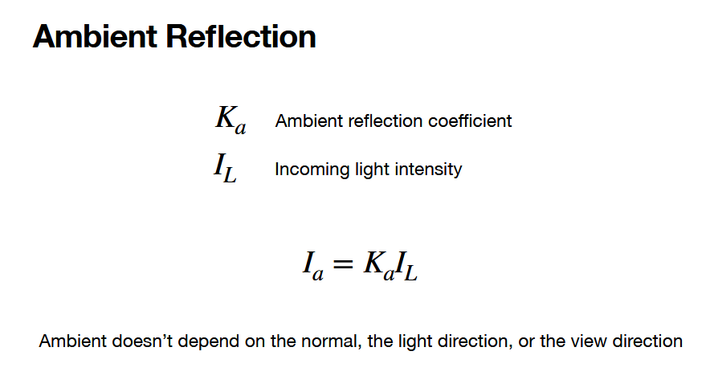
+ K_a gets tweaked, changing the ambient reflection with different weightings.
+ I_L does not really get changed---this will be fixed for all reflections in the environment.
+ this is rough estimation of all indirect light--ambient light i mean
  + you can't always assume this--this is for simplest lighting model
+ ambient color DOESNT CHANGE when object tilts

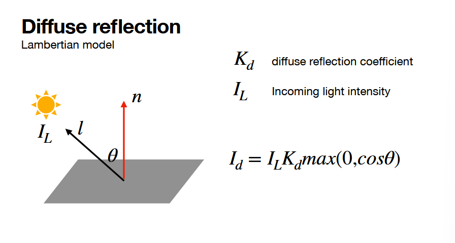
+ same idea, tweak that coefficient.
+ lighting/shading DOES change when the object tilts--because the area hit by the light changes, refresh from last time.

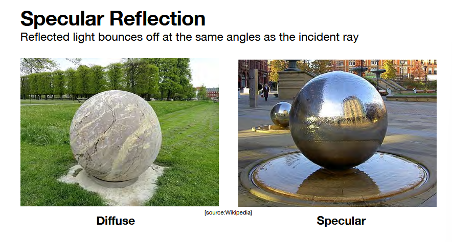

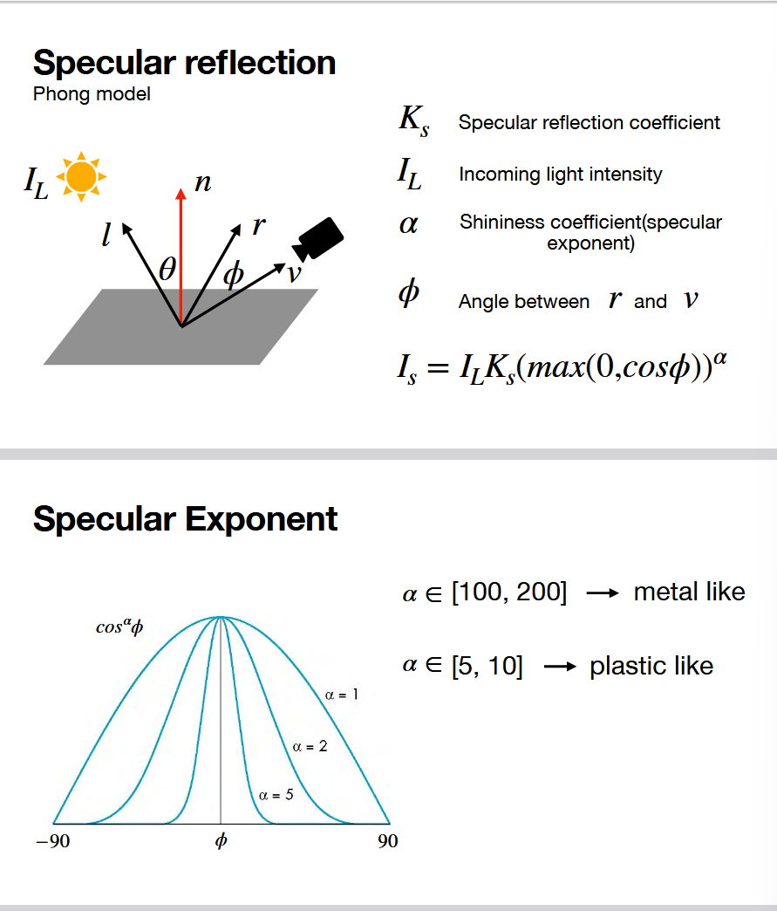
+ phong model!
+ notes that l/r is reflected, v is the vector to "camera"
+ the "fall off" from this reflected light is much quicker than diffuse
  + diffuse reflection scatters
  + specular reflection is very targeted
+ high alpha -- GLOSSY!!
  + if alpa == 1 -> just diffuse ;)

examples

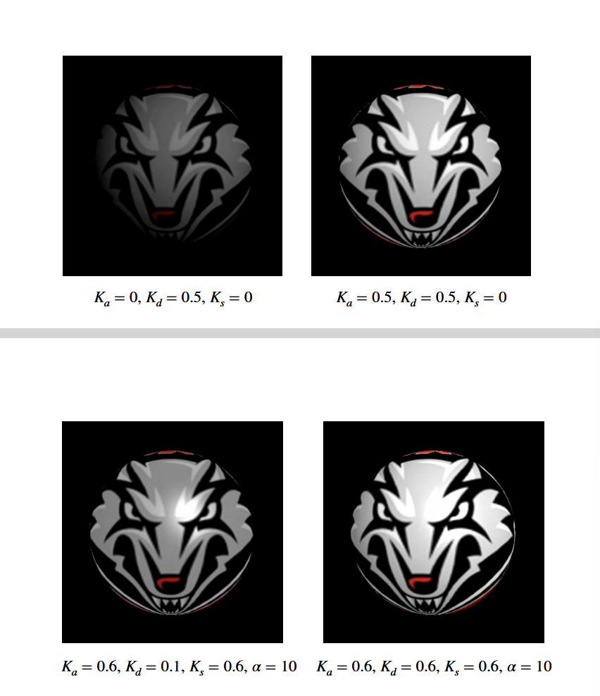

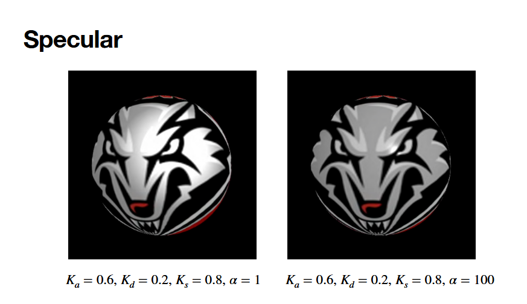

this is complete form of phong model with one light source:

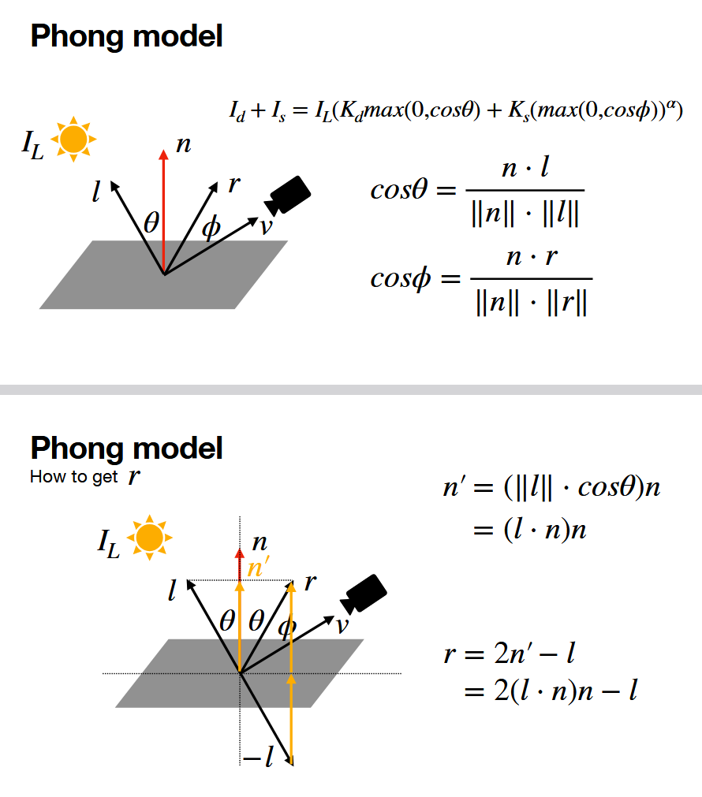
+ note that usually ||n|| is 1 (normal typically normalized), so sometimes not included in the calc.
+ note that we know where the camera is already ((0, 0, 1) or (0, 0, -1) typically)
+ you can always find n from the cross product
+ only unkown is r
  + we can find r by using the subtraction of two vectors (-l, the two golden vectors stacked, which are 2 n' s): 2n' - l -> sub in what n' is!

one other model:

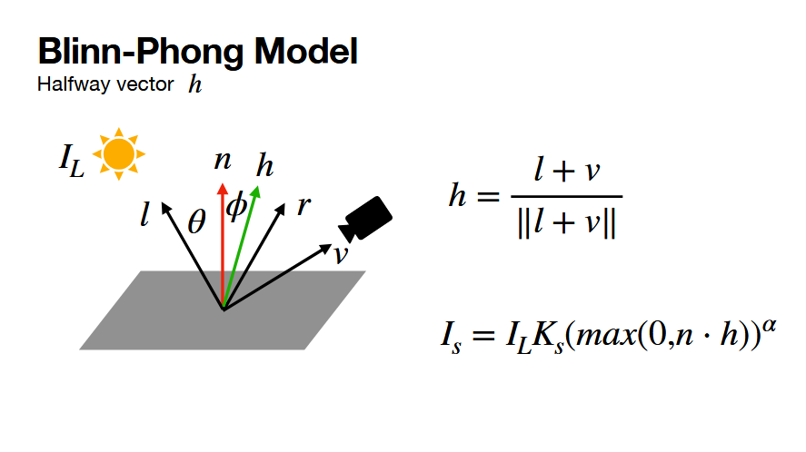
+ instead of getting r accurately, we figure out the halfway vector of l and v (h) -> purpose: save some computation instead of finding r.
  + less accurate, but pretty close and less computation
  + this was made in the 70s, when computation was at minimum

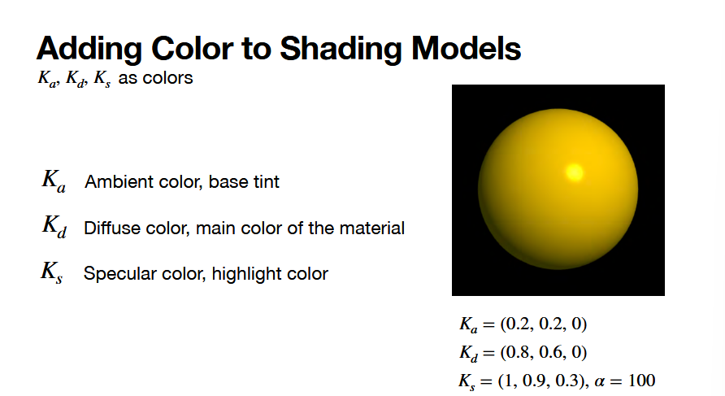
+ we've been talking up to this point about colors
+ but things have colors!!
+ define colors for the reflection coefficient
+ the I's talk about how color hits on the surface
  + we want to combine the reflection and coloring so that things appear realistic
+ (.2, .2, 0) -> NO blue reflected, reflect .2 red and .2 green channels.
  + for each reflection type, we are dot producting I and K (a, b ,c), (d , e, f)
  + then with element wise multiplacation with a ray of light (0, 0, 1) shows how much this object reflects pure blue light

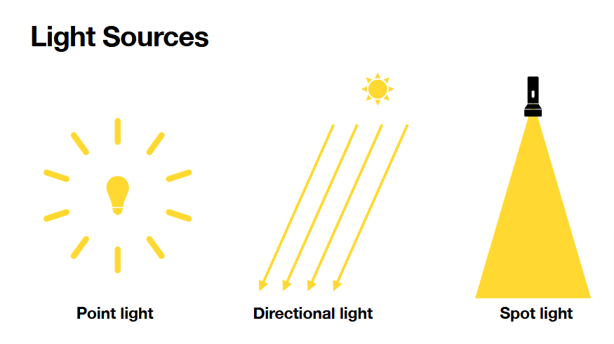

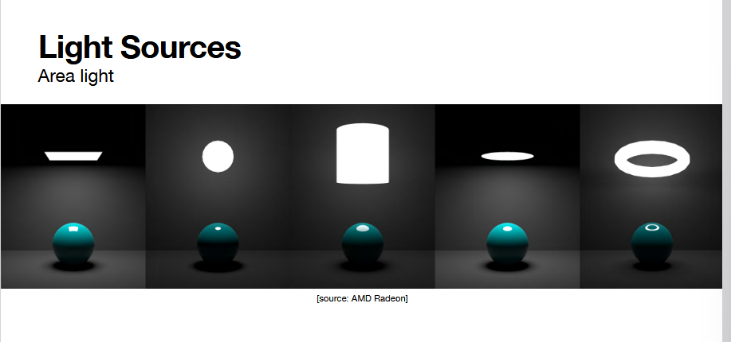
+ we aren't going to do this in class, just as a note

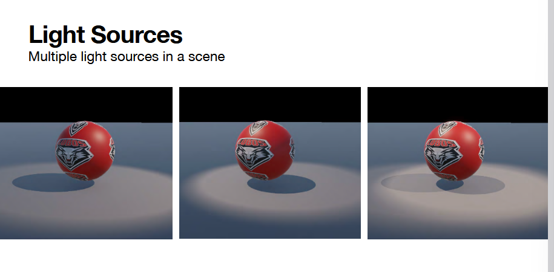
+ how to achieve? add up all light contributions! (except ambient)

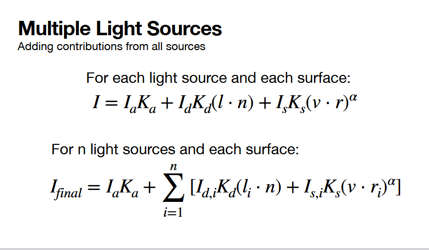

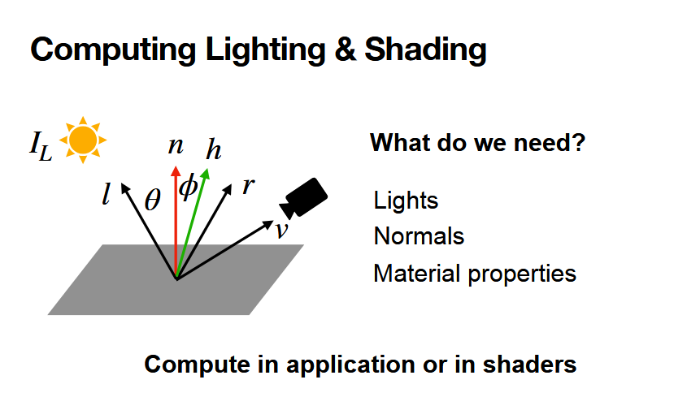
+ feel free to use resouces ;) to find right parameters for specific materials

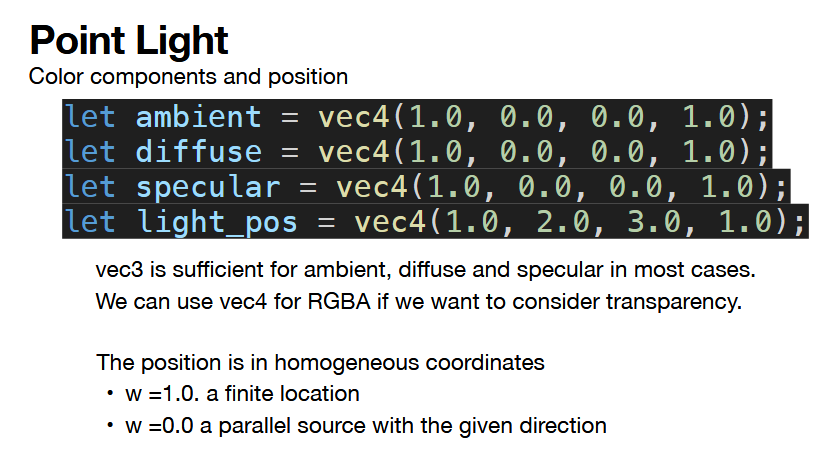

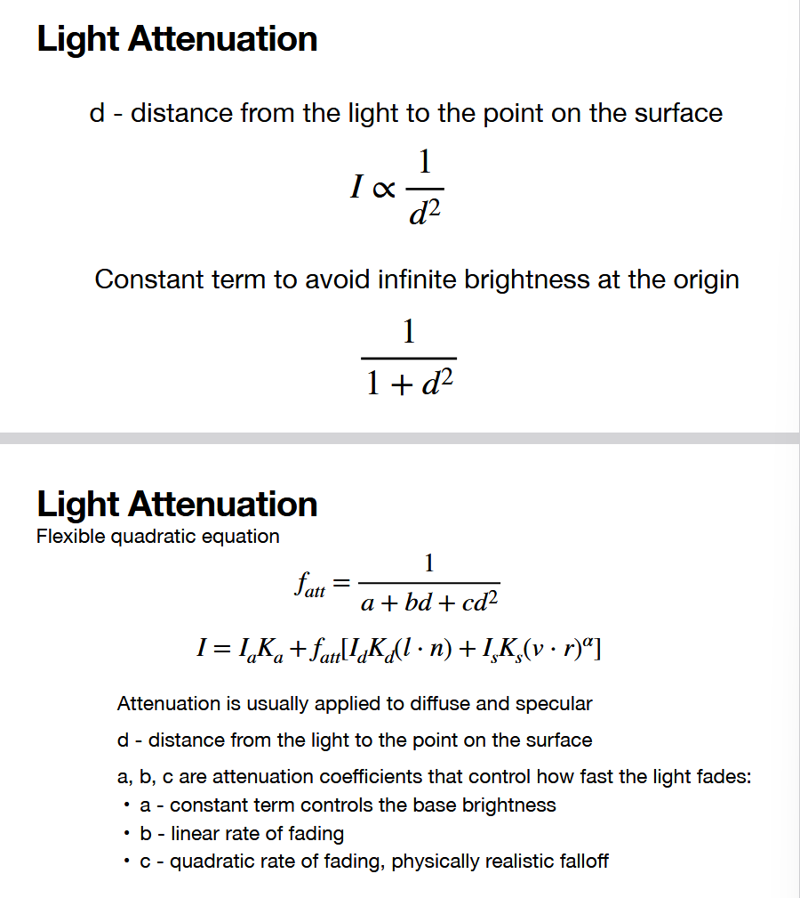
+ 1/d^2 is the correct physics, but usually too strong for reasonablness
+ when you use a quadratic, you get a stronger attenuation BUT is tunable to something better.
+ this comes in when you want to change lighting over time.

typical values -- empirical

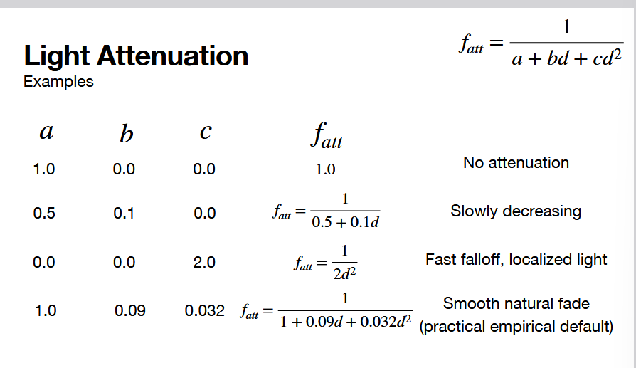

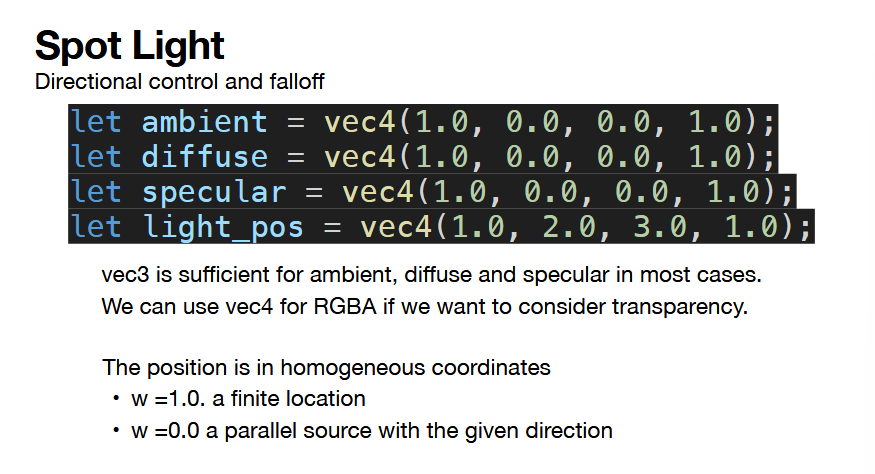

**note: he mentioned something about pt light and spot light slides are swapped -- update with new slides**

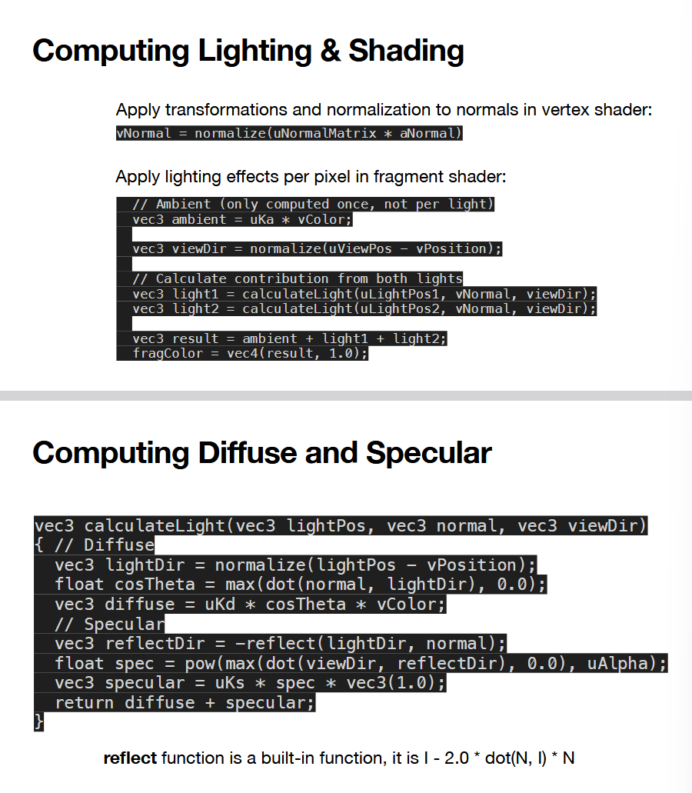