# 9.3.26

TODO make a webpage for hw submissions

TODO resub as a zip folder ha

next class: quiz; not graded only for practice, similar to midterm qs tho

y = Ax -> linear

y = Ax + B -> affine
+ helps to convert linear to non-linear
+ help of the IMAGINARY axis

## Rasterization

idea: how to determine which pixels to fill in given a shape defined by points.

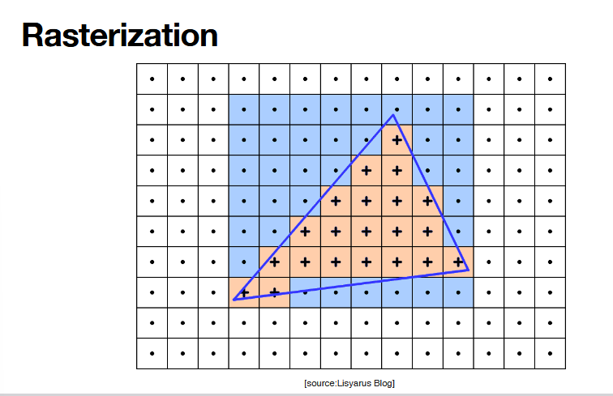

how do we take smooth geometric objects and turn them into pixels.

continuous point is mapped to discretized pixels. (remember discrete == countable == mapped to natural numbers.)

(1.0, 1.0) --> row 1, col 1:
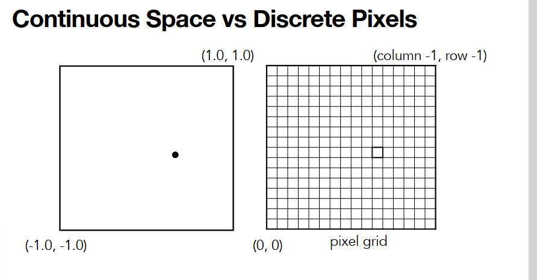
+ must map this point to which pixel on the screen.
+ what if (1.7, 1.0)? this is can be handeled under the hood by a pipeline or needs to be handled/accounted for by you (rounding, making the decision generally)
+ in discrete pixel world, you do NOT have infinite points, must stick to your mapping.

approximating shape: given points, what pixels are "covered by" the shape created by the points.
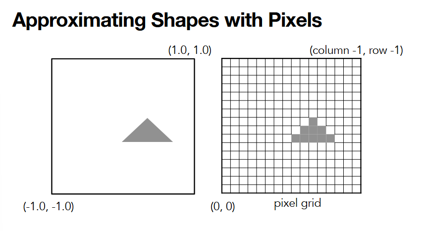
+ vertices define the shape
+ interpolation can help us figure out the rasterizing

2 ways to represent objects via points:
1. **explicit rep**

rep a simple curve:
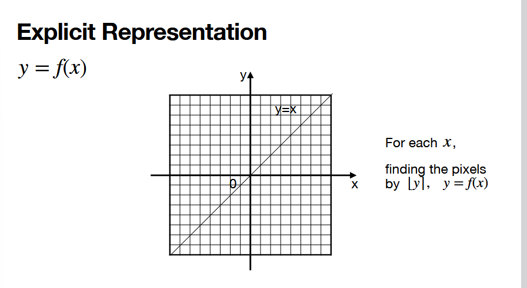 
+ fiven an x, spit out a y, linear mapping of point -> pixel
+ you can easily just color in each pixel along the line -- rasterizing DONE
+ color in the nearest pixel (nearest pixel) to that "curve"

obvious limiattion: represent a circle:
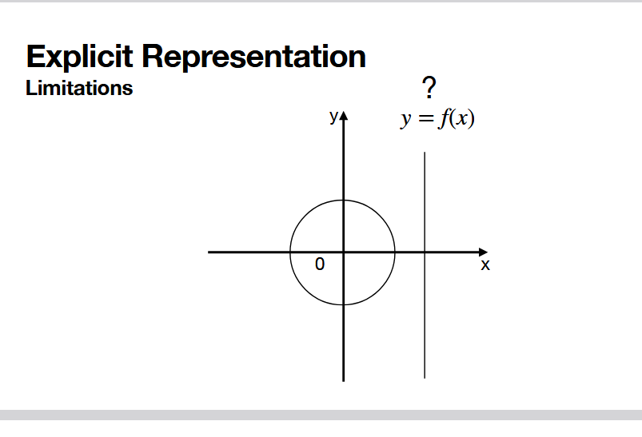
+ what if, given an x, you can get more than one y?? point -> more than one pixel is not awesome to work with

2. implicit rep
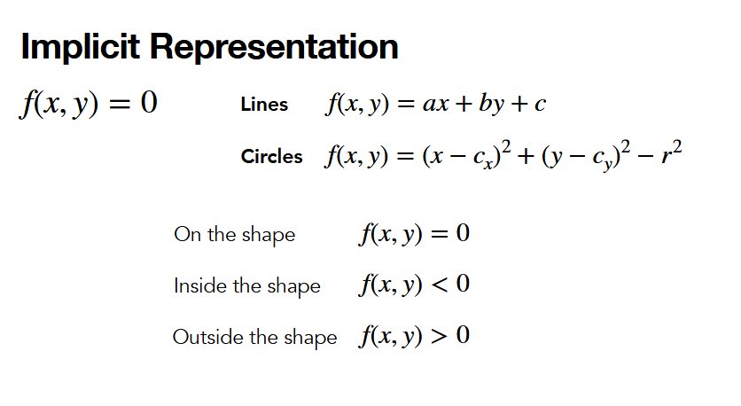
+ mapping: given a PAIR of x, y  point -> spit out a pixel
+ note the inside/outside shape
+ represent the linear mapping with a more flexible format that is more designed to describe a SPACE or REGION

## triangle daddy

**triangle is our atomic unit** 

refresh: why we like triangles is because they are the simplest way to define 3 and inner points in the same plane.
+ if 4 vertices, we CANNOT guarantee they are on the same plane
+ some rendering pipelines actually use parallelograms, but won't chat here about that TODO

before talking about if P is in, out, on edge of shape, let's talk:

### barycentric coordinates

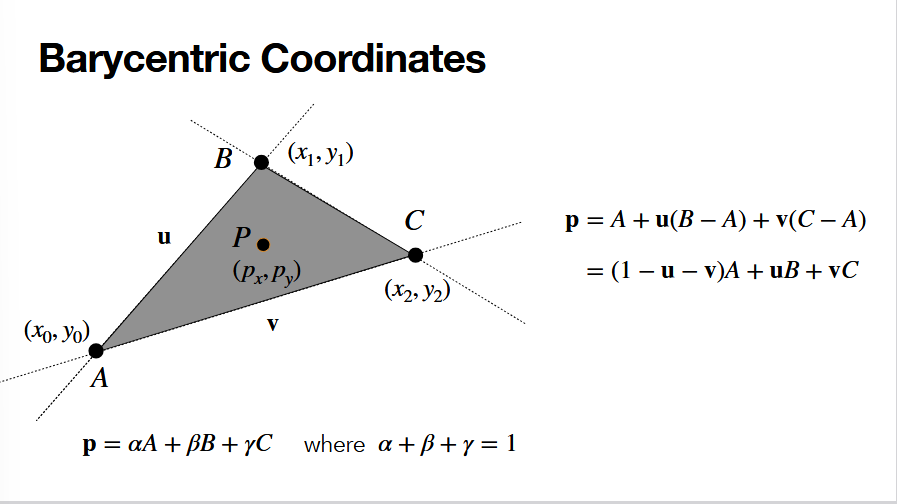
+ if P can be represented as a linear combination of the given points as a linear system, we can show it's "within" all 
+ can use vector AB, AC as a basis for this 2d plane
+ 1D
```
A ---------P-----> B, P is t units away from B:

P = A + t(B - A) // way to represent the point 
```
+ 2D is just an extra step of the above, but if the contribution of (C - A) is 0!
  + just an extrapolation to another dimension
+ this is done underhood by gpu and pipeline
+ the p = alpha A.... eq -> just rewriting the P calculation in 2d to a "what is the contribution of each vertex on P" sort of way
  + this is HOW the interpolation is accomplished!

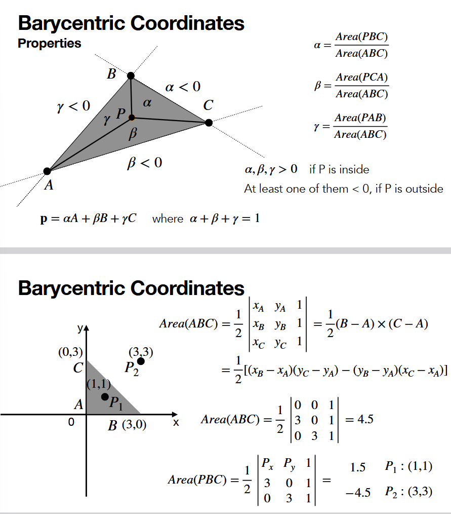

+ if we define alpha, beta, gamma as the areas shown above can get some nice assumptions about p
+ area of vectors can be calculated with cross product
  + 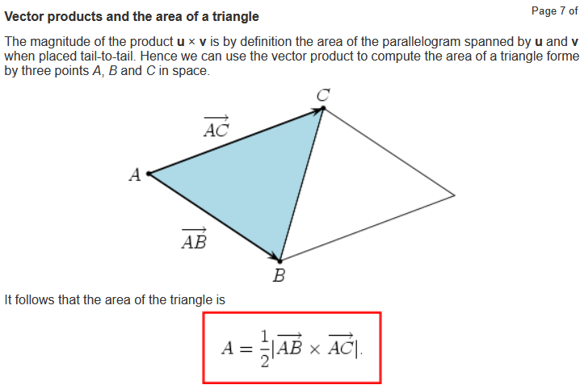
  + [src on cross](https://mathinsight.org/cross_product)
+ sign of those params represent orientation
+ next slide is illustrating that negative means OUTSIDE the triangle

little note on lighting
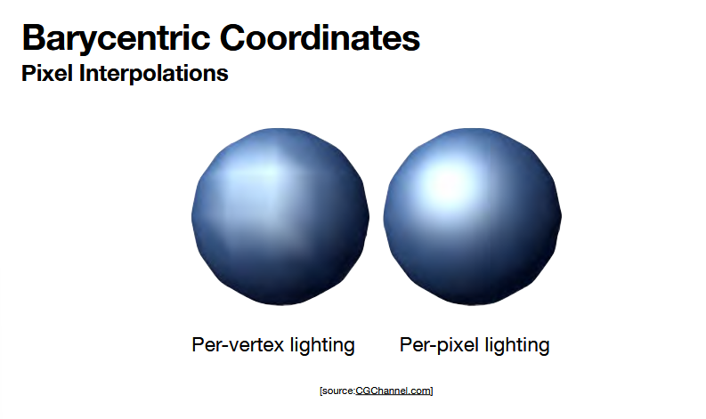
+ per-pixel -- uses barycentric coordinates and interpolation, we can fill in the lighting at a higher level by filling in the lighting by region, not by each individual pixel

**barycentric coordinates benefit pixel interpolation; it is how the gpu does pixel interpolation for you**


### clipping

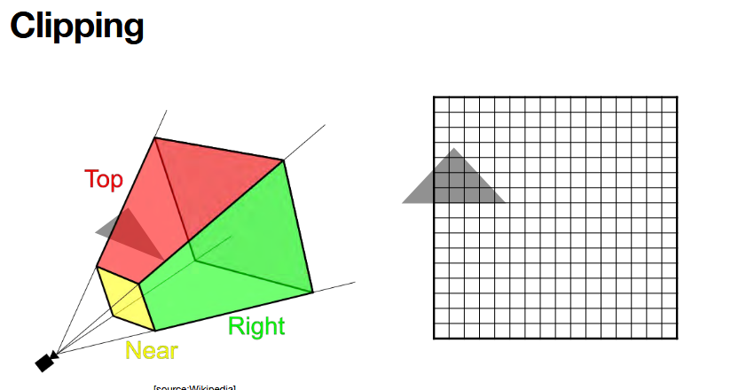
+ anything out of viewing plan is clipped automatically for you
+ we won't talk about this much, too complicated
+ 100s of ways to do this

### depth sort

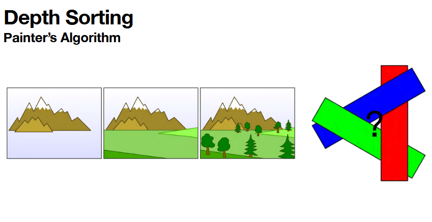
+ painters algo is simplest algo 
  + pic above has 3 defined layers
  + everything rendered layered by layer
  + we don't render layer by layer anymore
    + what if we're doing that nightmare overlap of rectangles? can't acheive that with painters algo
  

instead:

NOTE TYPO: ignore "Painter's Algo" below
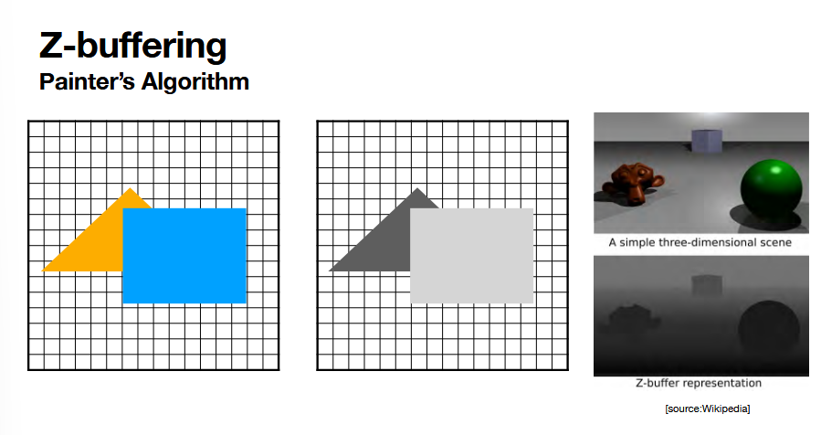
+ no layer by layer
+ for each pixel, you keep the nearest objects information in that pixel
+ highest priority z value object maintains control of the pixel
  + legit just go through each pixel and check to ensure the correct thing in object
  + YOU just need to keep track of depth
  + **note that even with "transparent" layers, you STILL need to define depth**.
    + **significant contribution in the pixel is still determined by the depth ordering.**

limitations of z buffer
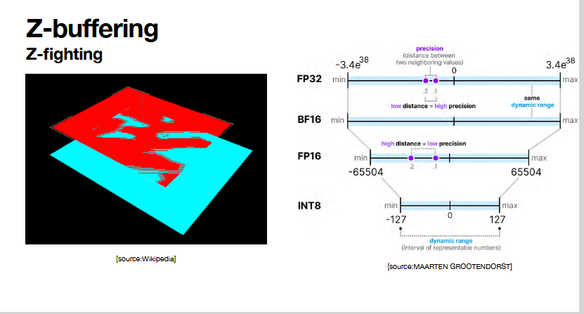
+ remember that float points cluster around 0
+ if we're rendering many many objects and many objects are very close to each other, the distinction becomes MUCH harder to make (2 things within 0.000001 of each other)
  + problem with representing things with low precision which need higher precision
  + precision is too low to represent such a small distance
+ TODO: look into this more
+ gl.DEPTH_TEST -> that's what gets the z-buffer working.

### antialiasing

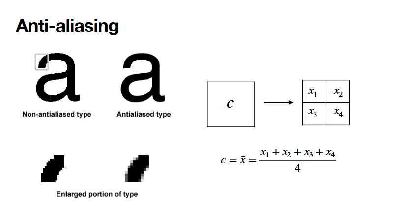

+ mathematically make something smoother.
+ divide a pixel into 4
+ curve passes through x1, x2, x3
+ and you dock down the rgb by like 70% -> gives you the correct grayscale for that c pixel as a whole