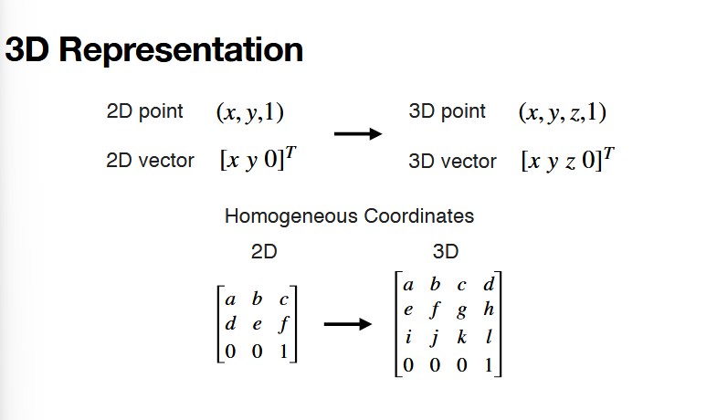
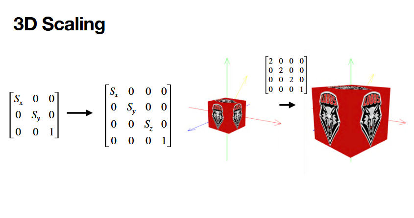
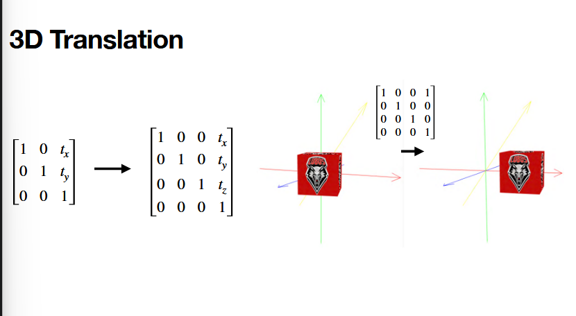
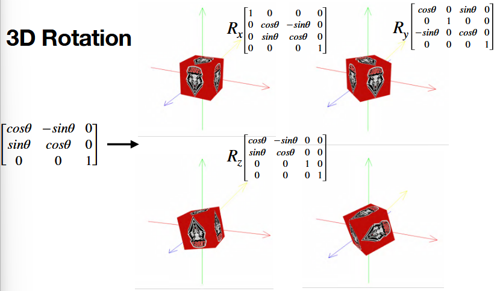
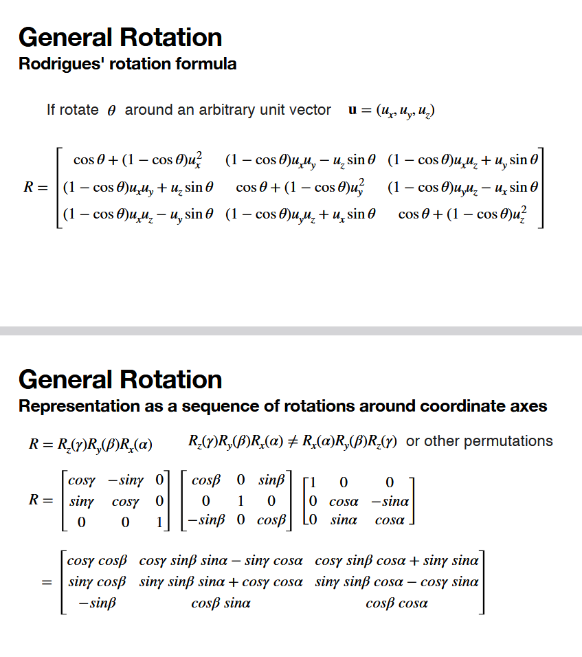
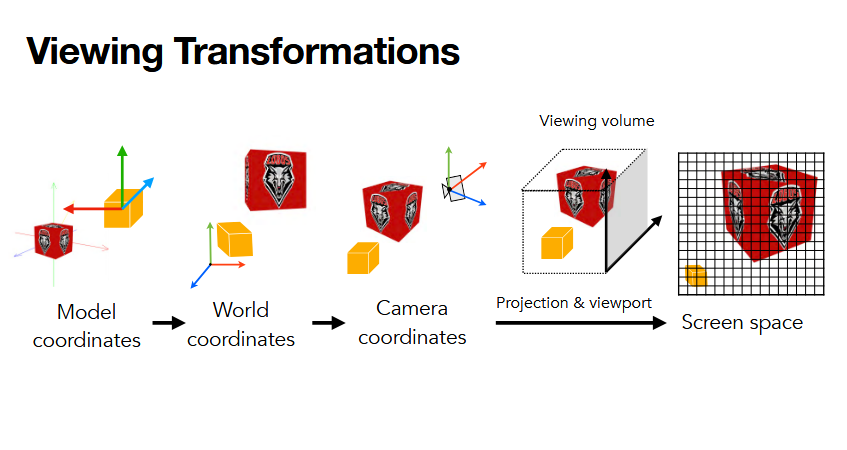
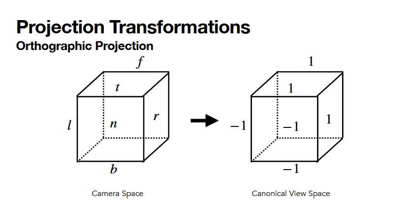
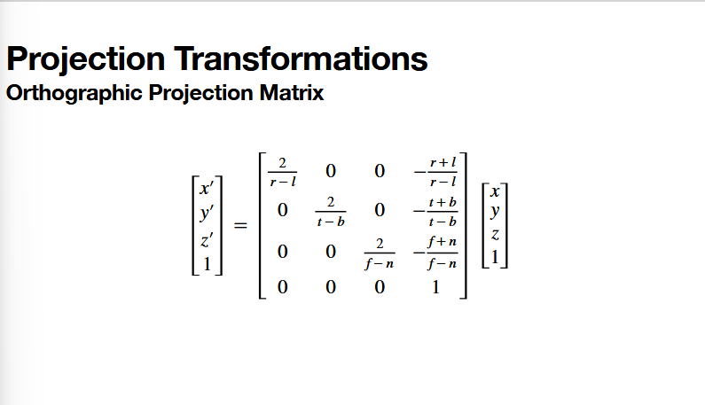

# 9.8.26

## talk 3d

refresh: point is position, vector is directionality

**uniform scaling** -- scale factors are the same

### 3d transformations
+ scaling relative to origin
+ translation is not
+ to scale properly, need to move back to the center, then scale, then move back to point

+ z is typically treated as the TOWARDS YOU direction (DEPENDS ON YOUR SYSTEM/LIBRARY!!)

general rotation nightmare!

+ can put together the top equations OR can depict as a sequence of rotations; whichever is the preference, same thing.
  + default convention of rotation of first equation is x, then y, then z
    + this other form allows for a different order of rotations.
  

REFRESH: best transformation pipeline is TRSp

+ the way we describe objects is in a coordinate system that is local to the object itself (model coordinates)
+ but we want to convert to a global reference (world coordinates) -- convert ALL the local systems to a world coordinate system
  + this needs to be defined to be able to have many objects working in the same system
    + we need to AGREE on the coordinate system
+ world coordinates describe the scene. the CAMERA describes how the PERSPECTIVE moves.
+ we then convert all of this to a screen space
+ the math of this is quite simple!

### projection transformation

1 approach: orthographic projection (simplest)

objects are projected straight down to the screen

no matter where you are, the projection will always be on the same spot
+ object doesnt shrink with distance?
+ essentially a normalization of one cube -> the normalized cube

say if i define my viewspace from -2 - 10. normalizing to a consistent -1, 1 makes items consistent.

dumbass note: l -> left, b -> bottom...and so on, boundary names

the projection matrix used for "normalizing"

+ right most column is a translation
+ the rest is...what, looks like a scaling?