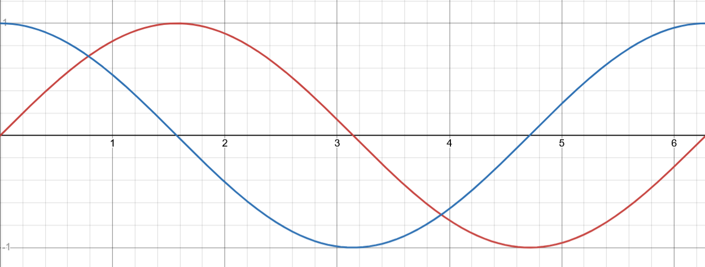
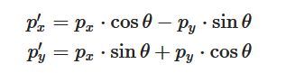
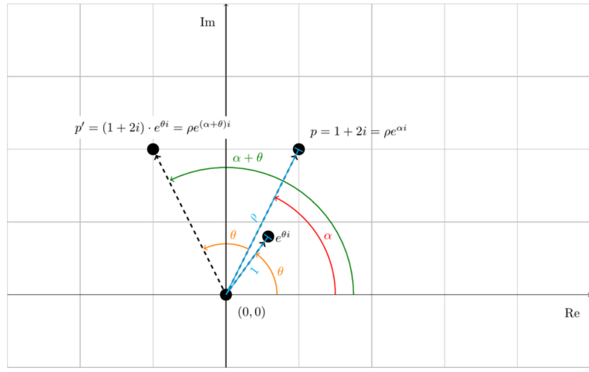
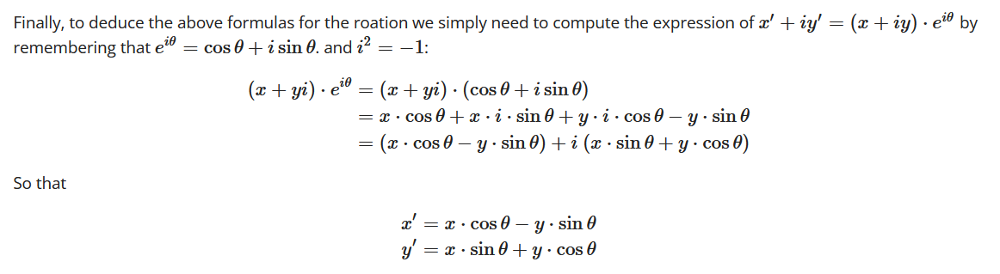

# rotating triangle

idea is to get the triangle to rotate.

## thought process

the idea should start by thinking about what happens when something is rotating 

think about the points themselves

*what is happening with the x values of a single point in the period?*

T = 0 -> starting point
T = 1 -> x coord goes right
T = 2 -> x coord goes right again
T = 3 -> x coord goes left
T = 4 -> x coord goes left again (back at the start)

*what is happening with the x values of a single point in the period?*

T = 0 -> starting point
T = 1 -> y coord goes up
T = 2 -> y coord goes down
T = 3 -> y coord goes down again
T = 4 -> y coord goes up (back at the start)

/* ----------------------------------------------------------- */

theres a same/same to the x, but the y starts at somewhat of an offset. 

the period reminds of of sin and cos again, especially since

cos -> same, same, diff, diff
sin -> same, diff, diff, same

see what i mean? the offset of rate of change is almost perfect.




so just this gives an illusion of rotating the triangle around the y-pole, if that makes sense.

**PROBLEM**: this changes ALL the vertices. complicating factor. how to have different paths for all?

```
void main() {
  gl_Position = vec4(cos(uTime) * aPosition.x, aPosition.y, aPosition.z, 1.0);
  vColor = aColor;
}
```

also just fun for showing the period changes: 
```
void main() {
  gl_Position = vec4(cos(uTime) * aPosition.x, sin(uTime) * aPosition.y, aPosition.z, 1.0);
  vColor = aColor;
}
```

would i have to do something like give all the vertices their own vertex shader?

the above path of a coordinate is specific to the left vertex of a triangle. it is different for the different vertices.

*matrix to rotate?*

utime is being set in the `render` function, that's being called constantly.

```
function render() {
  //clear the canvas
  gl.clearColor(0, 0, 0, 1);
  gl.clear(gl.COLOR_BUFFER_BIT | gl.DEPTH_BUFFER_BIT);
  gl.enable(gl.DEPTH_TEST);

  // Position buffer binding
  gl.bindBuffer(gl.ARRAY_BUFFER, posBuffer);
  gl.enableVertexAttribArray(posLoc);
  gl.vertexAttribPointer(posLoc, 3, gl.FLOAT, false, 0, 0);

  // Color buffer binding
  gl.bindBuffer(gl.ARRAY_BUFFER, colorBuffer);
  gl.enableVertexAttribArray(colorLoc);
  gl.vertexAttribPointer(colorLoc, 3, gl.FLOAT, false, 0, 0);

  //delta time in ms
  let deltaTime = Date.now() - startTime;
  //set time in seconds
  gl.uniform1f(timeLoc, deltaTime/1000.0);
  // console.log(deltaTime/1000.0) // ever increasing val in SECONDS

  // Draw content
  gl.drawArrays(gl.TRIANGLES, 0, 3);
}
```

that's why the period nature of the sin/cos is so smooth, using time in seconds from js

neat

```
void main() {
  gl_Position = vec4(aPosition.x * sin(uTime) - aPosition.y, aPosition.y, aPosition.z, 1.0);
  vColor = aColor;
}
```

also neat 
```
void main() {
  gl_Position = vec4(aPosition.x * sin(uTime) - aPosition.y * sin(uTime), aPosition.y * sin(uTime) - aPosition.x , aPosition.z, 1.0);
  vColor = aColor;
}
```

closer to a rotation
```
void main() {
  gl_Position = vec4(aPosition.x * sin(uTime) - aPosition.y, aPosition.y * cos(uTime) - aPosition.x , aPosition.z, 1.0);
  vColor = aColor;
}
```

```
void main() {
  gl_Position = vec4(aPosition.x * cos(uTime) - aPosition.y * sin(uTime), aPosition.y * sin(uTime) + aPosition.x * cos(uTime) , aPosition.z, 1.0);
  vColor = aColor;
} 
```

```
void main() {
  gl_Position = vec4(aPosition.x * sin(uTime) - sin(uTime) * aPosition.y * sin(uTime), aPosition.y * sin(uTime) + aPosition.x , aPosition.z, 1.0);
  vColor = aColor;
}
```

move triangle as a whole unit
```
void main() {
  gl_Position = vec4(aPosition.x + (sin(uTime)), aPosition.y + cos(uTime), aPosition.z, 1.0);
  vColor = aColor;
}
```

matrix version
```
#version 300 es
  // precision highp float;
  in vec3 aPosition;
  in vec3 aColor;

  uniform float uTime; //time in sec
  out vec3 vColor;

  void main() {
    //vec3 something = aPosition + 0.5;
    
    mat3 test = mat3(
      sin(uTime), 0.0, 0.0,
      0.0, 1.0, 0.0,
      0.0, 0.0, 1.0
    );

    vec3 something = test * aPosition;

     gl_Position = vec4(something, 1.0);

    //gl_Position = vec4(aPosition.y, aPosition.x, aPosition.z, 1.0);
    vColor = aColor;

    
  }
```

rotated on side with matrix
```
#version 300 es
  // precision highp float;
  in vec3 aPosition;
  in vec3 aColor;

  uniform float uTime; //time in sec
  out vec3 vColor;

  void main() {
    //vec3 something = aPosition + 0.5;
    
    // also neat, cos(in second row)
    mat3 test = mat3(
      0.0, sin(uTime), 0.0,
      sin(uTime), 0.0, 0.0,
      0.0, 0.0, 1.0
    );

    vec3 something = test * aPosition;

     gl_Position = vec4(something, 1.0);

    //gl_Position = vec4(aPosition.y, aPosition.x, aPosition.z, 1.0);
    vColor = aColor;

    
  }
  
// FOR ABOVE: cool 3d rotation effect:

/*
mat3 test = mat3(
  cos(uTime), sin(uTime), 0.0,
  sin(uTime), cos(uTime), 0.0,
  0.0, 0.0, 1.0
);

*/

```

this is a rotation of the whole triangle too 
```
vec3 test = vec3(-cos(uTime), sin(uTime), 0.0);
// fun:
// vec3 test = vec3(-cos(uTime) / aPosition.y, sin(uTime), 0.0); 
// makes it elliptical
// vec3 test = vec3(-cos(uTime), sin(uTime + 2.0), 0.0);
vec3 something = test + aPosition;

gl_Position = vec4(something, 1.0);
```

```
    vec3 test = vec3(-sin(uTime), sin(uTime), 0.0);

    vec3 something = test * aPosition;
```


leaving off for minute
#version 300 es
  // precision highp float;
  in vec3 aPosition;
  in vec3 aColor;

  uniform float uTime; //time in sec
  out vec3 vColor;

  void main() {
    //vec3 something = aPosition + 0.5;
    /*
    mat3 test = mat3(
      sin(uTime), 0.0, 0.0,
      0.0, -cos(uTime), 0.0,
      0.0, 0.0, 0.0
    );
    */

    vec3 test = vec3(
      -cos(uTime), 
      sin(uTime), 
      0.0
    );

    vec3 axis = vec3(0.0, 0.0, 0.0);

    vec3 something = (test * aPosition)  + axis;

    gl_Position = vec4(something, 1.0);

    //gl_Position = vec4(aPosition.y, aPosition.x, aPosition.z, 1.0);
    vColor = aColor;

    
  }

final: needed different rotation vectors:  
```
#version 300 es
  in vec3 aPosition;
  in vec3 aColor;

  uniform float uTime; //time in sec
  out vec3 vColor;

  void main() {
    vec3 rot_y = vec3(sin(uTime), cos(uTime), 0.0);
    vec3 rot_x = vec3(-cos(uTime), sin(uTime), 0.0);    
    vec3 trans = vec3(aPosition.x - 0.0, aPosition.y - 0.0, 1.0);

    float new_x = dot(rot_x, trans);
    float new_y = dot(rot_y, trans);

    vec3 new_pos = vec3(new_x, new_y, aPosition.z);

    // vec3 something = rot * trans;
    // vec3 something = test * aPosition; 
  

    // anchors to the green point:
    // new_pos += rot_x;


    gl_Position = vec4(new_pos, 1.0);
    //gl_Position = vec4(aPosition, 1.0);
    vColor = aColor;
  }
    
  
```
[rotation geometry proof](https://inginious.org/course/competitive-programming/geometry-rotation)








```
#version 300 es
  in vec3 aPosition;
  in vec3 aColor;

  uniform float uTime; //time in sec
  out vec3 vColor;

  vec2 center = vec2(0.0, 0.0);

  void main() {


    vec3 rot_y = vec3(sin(uTime), cos(uTime), 0.0);
    vec3 rot_x = vec3(-cos(uTime), sin(uTime), 0.0);    

    vec2 original_points = vec2(aPosition.x, aPosition.y);
   
    vec2 translated_points = original_points - center;
    
    vec3 trans = vec3(translated_points, 1.0);
   
    vec2 rotations = vec2(dot(rot_x, trans), dot(rot_y, trans));

    rotations = center - rotations;

    //float new_x = dot(rot_x, trans);
    //float new_y = dot(rot_y, trans);

    vec3 new_pos = vec3(rotations, aPosition.z);

    // vec3 something = rot * trans;
    // vec3 something = test * aPosition; 

    //new_pos += rot_y;

    gl_Position = vec4(new_pos, 1.0);
    //gl_Position = vec4(aPosition, 1.0);
    vColor = aColor;
  }
    
  
```

## side quest

different period colors:

```
// comment out the uTime in vertext shader
#version 300 es
  precision mediump float;
  in vec3 vColor;
  uniform float uTime;
  
  out vec4 fragColor;

  void main() {
    fragColor = vec4(vColor.x * (sin(uTime)), vColor.y * (sin(uTime + 1.57)), vColor.z * (sin(uTime + 3.14)), 1.0);
  }
```

